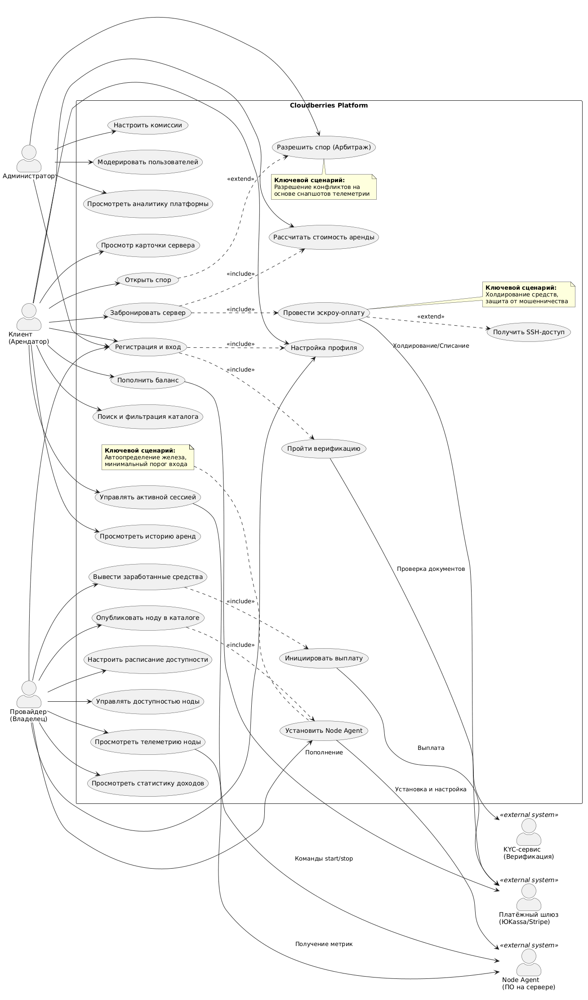

## 1. Исправленная Use Case диаграмма
Возможно тут присутствует некий overthink, но... 

## 2. Ранжирование вариантов использования

Для определения порядка реализации и фокусировки ресурсов на этапе MVP (Minimum Viable Product) был проведен анализ всех выявленных вариантов использования (Use Cases). Всего в системе Cloudberries выделено 18 вариантов использования.

### 3.1. Методология приоритизации
Ранжирование проводилось на основе матрицы **Business Value vs Criticality** (Бизнес-ценность против Критичности для ядра системы). 
*   **Бизнес-ценность (Business Value):** Насколько данный сценарий влияет на достижение ключевых KPI (выручка, удержание пользователей, формирование предложения).
*   **Критичность (Criticality):** Является ли данный сценарий блокирующим для работы других функций системы (без него система не может функционировать).

На основе этих критериев каждому варианту использования присвоен уровень приоритета:
*   **Critical (Критичный):** Фундамент бизнес-модели. Реализация обязательна в первую очередь.
*   **High (Высокий):** Важные вспомогательные сценарии, значительно улучшающие UX, но имеющие временные обходные пути (workarounds).
*   **Medium (Средний):** Операционные и административные функции, необходимые для полноценной работы, но не влияющие на первичную конверсию.
*   **Low (Низкий):** Функции, улучшающие удобство использования, которые могут быть отложены на следующие итерации.

### 3.2. Матрица приоритетов вариантов использования

| Приоритет | Вариант использования (Use Case) | Актор | Обоснование приоритета |
| :--- | :--- | :--- | :--- |
|**Critical** | **Провести эскроу-оплату** | Клиент | Генерирует выручку платформы. Без безопасной оплаты бизнес-модель P2P не работает. |
|**Critical** | **Установить Node Agent** | Провайдер | Формирует предложение на рынке. Без подключенных нод нечего арендовать. |
|**Critical** | **Разрешить спор (Арбитраж)** | Администратор | Ключевое конкурентное преимущество (Trust Layer). Обеспечивает доверие к эскроу. |
|**High** | Поиск и фильтрация каталога | Клиент | Необходим для выбора сервера, но является подготовительным этапом перед оплатой. |
|**High** | Опубликовать ноду в каталоге | Провайдер | Логическое продолжение установки агента. Делает сервер видимым для клиентов. |
|**High** | Вывести заработанные средства | Провайдер | Критично для удержания провайдеров, но происходит после успешной аренды. |
|**Medium** | Регистрация и вход | Все | Базовая функция. Важна, но сама по себе не несет бизнес-ценности без последующих действий. |
|**Medium** | Управление доступностью ноды | Провайдер | Операционная функция для удобства провайдера. |
|**Medium** | Пополнить баланс | Клиент | Альтернатива прямой оплате. Упрощает UX, но не является строго обязательным для MVP. |
|**Medium** | Модерировать пользователей | Администратор | Внутренняя административная функция для поддержания качества платформы. |
|**Low** | Просмотреть аналитику платформы | Администратор | Важно для стратегического развития, но не влияет на ежедневные операции пользователей. |
|**Low** | Настроить комиссии | Администратор | Гибкая настройка бизнес-модели. |

## 4. Выделение 10-20% наиболее важных вариантов использования

Согласно **принципу Парето**, 20% функциональности системы обеспечивают 80% её бизнес-ценности. Из общего списка вариантов использования мы выделяем **3 ключевых сценария**, которые образуют «Ядро» и полностью определяют назначение проекта Cloudberries.

### Выбранные ключевые сценарии:

1.  **Провести эскроу-оплату (Арендовать вычислительные мощности)**
    *   **Роль:** Замыкает цикл спроса.
    *   **Почему это важно:** Это основной монетизируемый сценарий. Именно здесь реализуется главное УТП платформы — защита сделки через холдирование средств. Если этот сценарий не работает, платформа не приносит дохода и не вызывает доверия у клиентов.

2.  **Установить Node Agent (Опубликовать ноду в каталоге)**
    *   **Роль:** Запускает цикл предложения.
    *   **Почему это важно:** Cloudberries — двусторонний маркетплейс. Без простого и надежного механизма подключения оборудования провайдеров каталог останется пустым, и арендовать будет нечего. Низкий порог входа здесь критичен для роста базы поставщиков.

3.  **Разрешить спор (Арбитраж)**
    *   **Роль:** Обеспечивает безопасность и доверие.
    *   **Почему это важно:** Отличает Cloudberries от анонимных P2P-площадок. Наличие механизма объективного разрешения конфликтов на основе телеметрии снижает риски мошенничества и удерживает пользователей на платформе.

### Обоснование выбора
Данные три сценария были выбраны для детальной проработки, так как они несут максимальные бизнес-риски, требуют сложной логики взаимодействия с внешними системами и напрямую влияют на ключевые метрики успеха, определенные в бизнес-требованиях. Остальные вариантs использования являются вспомогательными и будут реализованы в рамках стандартных процедур без необходимости глубокого моделирования на данном этапе.

## 5. Детальная спецификация ключевых вариантов использования

### 5.1. Use Case UC-1: «Арендовать вычислительные мощности»
**Акторы:** Клиент (инициатор), Платёжный шлюз (вторичный актор) 
**Цель:** Клиент получает доступ к удалённому серверу для выполнения своих задач, средства безопасно замораживаются на эскроу-счёте. 
**Предусловия:** Клиент зарегистрирован, прошёл базовую верификацию, имеет достаточный баланс или привязанную карту. 
**Постусловия:** Создана активная Бронь, средства заморожены, клиент получил SSH-доступ. 

#### **Основной успешный сценарий**
| Шаг | Действие актора | Ответ системы |
|:---|:---|:---|
| 1 | Клиент открывает каталог и задаёт параметры поиска (мощность, цена, регион) | Система отображает список доступных Нод с характеристиками и ценами |
| 2 | Клиент выбирает Ноду и указывает длительность аренды | Система рассчитывает итоговую стоимость (с учётом комиссии) и показывает её Клиенту |
| 3 | Клиент подтверждает бронирование | Система создаёт Бронь со статусом «Ожидает оплаты» и резервирует Ноду |
| 4 | — | Система передаёт Платёжному шлюзу запрос на холдирование средств |
| 5 | Клиент вводит платёжные данные и подтверждает оплату | Платёжный шлюз замораживает средства и возвращает системе подтверждение |
| 6 | — | Система переводит Бронь в статус «Активна», создаёт Эскроу-транзакцию |
| 7 | — | Система генерирует Учётные данные для доступа (IP, SSH-ключ) |
| 8 | — | Система передаёт Ноду команду на запуск контейнера для Клиента |
| 9 | Клиент получает SSH-доступ и начинает работу | Система запускает поминутный учёт использования |
| 10 | По истечении времени аренды (или по команде Клиента) | Система завершает Бронь, списывает фактическую сумму в пользу Провайдера, возвращает остаток Клиенту |

#### **Альтернативные сценарии**
**2а. Подходящие Ноды не найдены **
- 2а1. Система сообщает об отсутствии подходящих серверов. 
- 2а2. Клиент меняет параметры поиска или завершает сценарий. 

**3а. Клиент отменяет бронирование до оплаты **
- 3а1. Система удаляет резерв Ноды и завершает сценарий. 

**4а. Платёжный шлюз недоступен **
- 4а1. Система уведомляет Клиента о временной недоступности оплаты. 
- 4а2. Клиент может повторить попытку позже или выбрать другой способ оплаты. 

**5а. Отказ в проведении платежа (недостаточно средств / отклонено банком) **
- 5а1. Платёжный шлюз возвращает отказ. 
- 5а2. Система отменяет Бронь, снимает резерв с Ноды. 
- 5а3. Клиент получает уведомление об отказе и может попробовать другую карту. 

**8а. Нода не отвечает при запуске контейнера (таймаут) **
- 8а1. Система не получает подтверждения готовности от Ноды в течение заданного времени. 
- 8а2. Система автоматически отменяет Бронь и размораживает средства. 
- 8а3. Клиент получает уведомление о сбое и полном возврате средств. 
- 8а4. Нода помечается как «Недоступна» до проверки. 

**9а. Клиент досрочно завершает сессию **
- 9а1. Клиент инициирует остановку сессии. 
- 9а2. Система останавливает контейнер, фиксирует фактическое время использования. 
- 9а3. Неиспользованная часть средств возвращается Клиенту. 

### Диаграмма деятельности UC-1

### Системная диаграмма последовательности UC-1

### Выявленные объекты предметной области UC-1
| Объект | Описание | Атрибуты |
|:---|:---|:---|
| **Клиент** | Пользователь, арендующий вычислительные мощности | id, имя, email, баланс |
| **Провайдер** | Владелец Ноды, предоставляющий ресурсы | id, имя, рейтинг |
| **Нода** | Вычислительный ресурс с характеристиками | id, характеристики (CPU/RAM/GPU), цена в час, статус, регион |
| **Бронь** | Связующий объект между Клиентом, Нодой и сделкой | id, статус, дата начала, дата окончания, итоговая сумма |
| **Эскроу-транзакция** | Запись о заморозке/списании средств | id, сумма, статус (холд/списано/возврат), ссылка на Бронь |
| **Учётные данные для доступа** | Информация для подключения к Ноде | IP-адрес, порт, SSH-ключ, срок действия |
| **Платёжный шлюз** | Внешняя система обработки платежей | (внешний актор) |

### 5.2. Use Case UC-2: «Подключить и сдать сервер в аренду»
**Акторы:** Провайдер (инициатор), Node Agent (вторичный актор — ПО на сервере) 
**Цель:** Провайдер регистрирует своё оборудование в каталоге платформы и начинает получать доход от его аренды. 
**Предусловия:** Провайдер зарегистрирован, прошёл расширенную верификацию (KYC), имеет сервер с подходящими характеристиками. 
**Постусловия:** Нода опубликована в каталоге, доступна для аренды, Провайдер может отслеживать доходы. 

#### **Основной успешный сценарий**
| Шаг | Действие актора | Ответ системы |
|:---|:---|:---|
| 1 | Провайдер заходит в личный кабинет и инициирует добавление сервера | Система генерирует уникальный токен установки и скрипт подключения |
| 2 | Провайдер запускает скрипт на своём сервере | Node Agent устанавливается и определяет характеристики оборудования |
| 3 | — | Node Agent передаёт характеристики в Систему |
| 4 | — | Система создаёт запись Ноды со статусом «Неактивна» |
| 5 | Провайдер устанавливает цену за час и расписание доступности | Система сохраняет настройки |
| 6 | Провайдер включает доступность Ноды | Система переводит Ноду в статус «Доступна» и публикует в каталоге |
| 7 | — | Node Agent начинает отправлять сигналы готовности (heartbeat) |
| 8 | Поступает заказ от Клиента (UC-1) | Система передаёт Ноду команду на запуск контейнера |
| 9 | — | Node Agent запускает контейнер и начинает передавать телеметрию |
| 10 | Сессия завершается | Система начисляет доход на счёт Провайдера |
| 11 | Провайдер инициирует вывод средств | Система переводит деньги на карту Провайдера |

#### **Альтернативные сценарии**
**3а. Node Agent не может определить характеристики **
- 3а1. Система запрашивает у Провайдера ручной ввод характеристик. 
- 3а2. Провайдер заполняет форму, Система проверяет данные. 

**4а. Нода с таким идентификатором уже существует **
- 4а1. Система уведомляет Провайдера о дубликате. 
- 4а2. Провайдер удаляет старую запись или завершает сценарий. 

**7а. Node Agent перестаёт отправлять heartbeat **
- 7а1. Система переводит Ноду в статус «Недоступна». 
- 7а2. Нода скрывается из каталога. 
- 7а3. Провайдер получает уведомление о потере связи. 

**11а. Недостаточно средств для вывода (ниже минимального порога) **
- 11а1. Система уведомляет Провайдера о минимальной сумме вывода. 
- 11а2. Провайдер накапливает средства или завершает сценарий. 

### Диаграмма деятельности UC-2

### Системная диаграмма последовательности UC-2

### Выявленные объекты предметной области UC-2
| Объект | Описание | Атрибуты (предварительно) |
|:---|:---|:---|
| **Провайдер** | Владелец оборудования | id, имя, реквизиты для выплат, статус верификации |
| **Нода** | Вычислительный ресурс | id, характеристики, цена, расписание, статус, токен установки |
| **Node Agent** | Программа на сервере Провайдера | версия, статус соединения, время последнего heartbeat |
| **Телеметрия** | Показатели работы Ноды | время, загрузка CPU/RAM/GPU, температура |
| **Доход** | Начисление Провайдеру за сессию | id, сумма, дата, ссылка на Бронь |

### 5.2. Use Case UC-2: «Подключить и сдать сервер в аренду»
**Акторы:** Клиент или Провайдер (инициатор), Администратор (арбитр) 
**Цель:** Объективно разрешить конфликт между Клиентом и Провайдером на основе фактических данных телеметрии. 
**Предусловия:** Существует активная или завершённая Бронь, одна из сторон инициировала спор. 
**Постусловия:** Спор закрыт, средства распределены согласно решению, репутации сторон обновлены. 

#### **Основной успешный сценарий**
| Шаг | Действие актора | Ответ системы |
|:---|:---|:---|
| 1 | Клиент (или Провайдер) инициирует спор по конкретной Брони | Система переводит Бронь в статус «Спор», замораживает Эскроу-транзакцию |
| 2 | — | Система автоматически собирает доказательства: снапшоты Телеметрии за период аренды, историю команд, логи |
| 3 | — | Система уведомляет обе стороны об открытии спора |
| 4 | Администратор открывает панель арбитража | Система отображает детали Брони, характеристики Ноды, графики Телеметрии, переписку сторон |
| 5 | Администратор изучает материалы и выносит решение | Система фиксирует решение (возврат Клиенту / выплата Провайдеру / частичное распределение) |
| 6 | — | Система исполняет решение: переводит средства согласно вердикту |
| 7 | — | Система обновляет репутацию виновной стороны |
| 8 | — | Система уведомляет обе стороны о результате |

#### **Альтернативные сценарии**
**1а. Спор инициирован после автоматического завершения Брони **
- 1а1. Система позволяет открыть спор в течение 24 часов после завершения. 
- 1а2. Эскроу-транзакция уже закрыта — Система размораживает средства на специальном счёте до решения. 

**4а. Недостаточно данных для принятия решения **
- 4а1. Администратор запрашивает дополнительные доказательства у сторон. 
- 4а2. Стороны загружают скриншоты, логи, объяснения. 
- 4а3. Администратор принимает решение на основе расширенного набора данных. 

**5а. Стороны приходят к мировому соглашению **
- 5а1. Стороны договариваются о распределении средств самостоятельно. 
- 5а2. Администратор утверждает соглашение и закрывает спор. 

### Диаграмма деятельности UC-3

### Системная диаграмма последовательности UC-3

### Выявленные объекты предметной области UC-3
| Объект | Описание | Атрибуты (предварительно) |
|:---|:---|:---|
| **Спор** | Конфликт между сторонами по конкретной Брони | id, статус, причина, дата открытия, дата закрытия |
| **Доказательство** | Фактические данные по спору | тип (телеметрия/лог/скриншот), ссылка на источник, дата прикрепления |
| **Решение** | Вердикт Администратора | тип (возврат/выплата/частично), сумма, дата |
| **Репутация** | Оценка надёжности стороны | рейтинг, количество завершённых сделок, доля прерванных сессий |

### 5.4. Сводная диаграмма классов предметной области
На основе анализа трёх ключевых Use Case выявлены следующие объекты предметной области и связи между ними. Диаграмма выполнена в бизнес-терминах, без технических деталей реализации.

### 5.5. Связь с моделью данных из Итерации 5
Выявленные в ходе спецификации Use Case объекты предметной области напрямую соответствуют таблицам логической модели данных, спроектированной в Итерации 5:
| Объект предметной области | Таблица в БД (Итерация 5) | Контекст DDD |
|:---|:---|:---|
| Клиент / Провайдер / Администратор | `users` | Identity Context |
| Нода | `nodes` + `hardware_specs` | Catalog Context |
| Бронь | `bookings` | Booking Context |
| Эскроу-транзакция | `escrow_transactions` | Booking Context |
| Учётные данные для доступа | `access_credentials` | Booking Context |
| Телеметрия | `telemetry_sessions` + `metrics_snapshots` | Telemetry Context |
| Спор | `disputes` | Dispute Context |
| Доказательство | `evidences` | Dispute Context |
| Решение | `resolutions` | Dispute Context |
| Репутация | `reputations` | Catalog Context |

Это подтверждает целостность и непротиворечивость решения: бизнес-объекты, выявленные при моделировании Use Case, полностью покрываются спроектированной моделью данных, а модель данных, в свою очередь, поддерживает все ключевые сценарии использования системы.