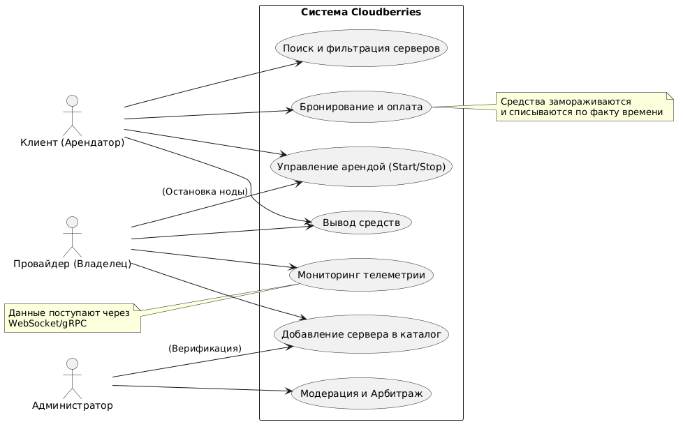
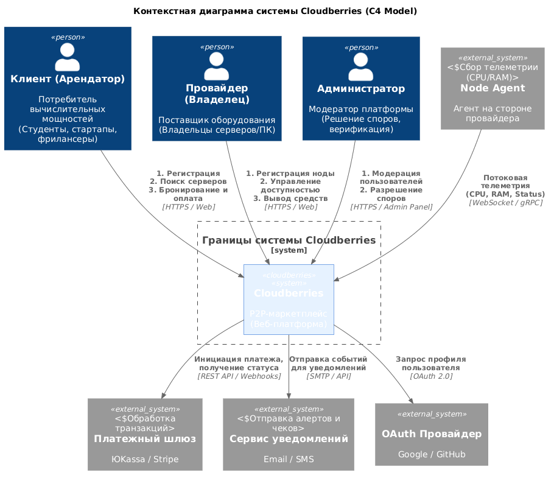
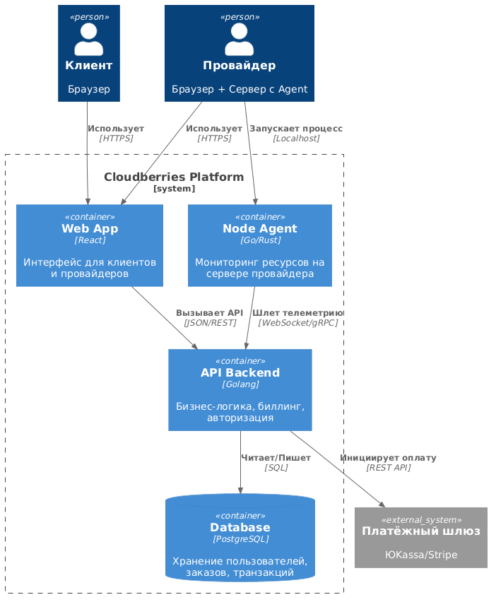
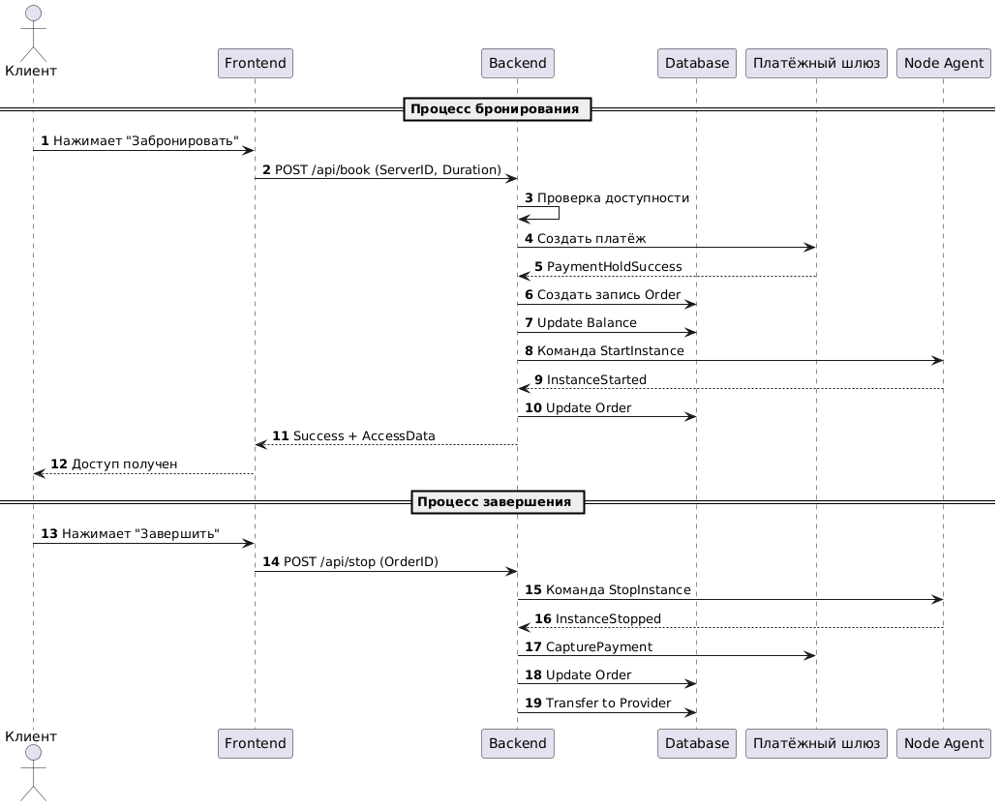

# 1. Анализ конкурентных решений и контуры продукта

## 1.1. Список отобранных конкурентов

Для сравнения выбраны три репрезентативных конкурента, представляющих разные модели рынка:
- **Vast.ai** — P2P-агрегатор частных и дата-центровых серверов
- **RunPod** — Облачная платформа для AI/ML с serverless-подходом
- **AWS EC2** — Централизованное enterprise-облако

| Название | Тип платформы | Основная аудитория | Краткое описание |
|----------|---------------|-------------------|------------------|
|  Vast.ai  | P2P-агрегатор GPU | ML-разработчики, рендеры | Аренда частных и дата-центровых серверов по часам |
|  RunPod | Гибридное облако (Serverless + Bare Metal) | Стартапы, AI-энтузиасты | Упрощённый доступ к GPU без настройки инфраструктуры |
|  AWS EC2 / GCP  | Централизованные облака | Enterprise, крупный бизнес | Полный набор облачных сервисов с гарантированным SLA |

## 1.2. Детальный анализ (Плюсы и Минусы)

### 🔹 Конкурент 1: Vast.ai

**Плюсы:**

- Одна из самых низких цен на рынке GPU

- Огромный выбор конфигураций (от GTX 1080 до RTX 4090)

- Быстрая аренда «в один клик»

**Минусы:**

- Нестабильный аптайм (оборудование часто потребительское)

- Оплата преимущественно в криптовалюте

- Отсутствие официальной техподдержки и SLA

- Риски безопасности при работе с bare-metal серверами

### 🔹 Конкурент 2: RunPod

**Плюсы:**

- Удобный UI/UX, низкий порог входа

- Поддержка fiat-оплаты (карты)

- Serverless-режим для быстрого запуска задач

- Активное комьюнити и документация

**Минусы:**

- Цены выше, чем у чистых P2P-площадок

- Ограниченный контроль над инфраструктурой

- Не подходит для долгосрочного хостинга веб-сервисов

### 🔹 Конкурент 3: AWS / Google Cloud

**Плюсы:**

- Гарантированный SLA 99.9%+

- Полная экосистема (БД, хранилища, сети, мониторинг)

- Профессиональная техподдержка и безопасность

**Минусы:**

- Высокая стоимость (недоступно для студентов и микро-стартапов)

- Сложная тарификация и скрытые платежи

- Vendor lock-in и долгий онбординг

---

## 1.3. Сравнительная матрица ключевых характеристик

  
| Критерий | Cloudberries| Конкурент 1 | Конкурент 2 | Конкурент 3 |
|----------|-------------|-------------|-------------|-------------|
| Модель оплаты | Fiat (карты) + прозрачный калькулятор | Крипта / Fiat | Fiat | Fiat (сложная тарификация) |
| Гарантия стабильности | Базовая верификация + эскроу | Отсутствует | Средняя | Высокая (SLA) |
| Порог входа | Низкий (регистрация за 1 мин) | Средний | Низкий | Высокий |
| Целевая аудитория | Студенты, стартапы, фрилансеры | ML-разработчики | AI-стартапы | Enterprise |
| Безопасность сделок | Эскроу-счета, арбитраж | Минимальная | Средняя | Высокая |
| Гибкость конфигураций | Фильтры по CPU/RAM/GPU, почасовая аренда | Высокая | Средняя | Очень высокая |

---

## 1.4. Контуры продукта Cloudberries (Позиционирование и отличия)

### Ниша и УТП

Cloudberries занимает промежуточную нишу между **ненадёжными P2P-сетями** и **дорогими enterprise-облаками**.

**УТП:** «Доступные вычислительные мощности без криптобарьеров, сложных настроек и переплат. Оплата картой, честный калькулятор и защита сделки через эскроу».

### Что мы берём от рынка:

- [x] Почасовую модель аренды (как у Vast.ai / RunPod)

- [x] Простой каталог с фильтрами по характеристикам

- [x] Разделение ролей «Поставщик / Клиент»

- [x] Личные кабинеты с аналитикой

### Что мы отсекаем / улучшаем:

- [x] Криптовалютные платежи → заменяем на fiat + классические платёжные шлюзы

- [x] Сложную тарификацию → внедряем прозрачный калькулятор до оплаты

- [x] Отсутствие гарантий → вводим эскроу-счета и верификацию поставщиков

- [x] Узкую специализацию (только GPU) → поддерживаем CPU, RAM, SSD для рендера, хостинга, ML

# 2. Основные функции и характеристики, реализованные в выбранных решениях

## Сравнительная матрица функций

| Функция / Характеристика | Vast.ai | RunPod | AWS EC2 |
|:--------------------------|:--------|:-------|:--------|
| **Регистрация и верификация** | Email, базовый KYC для вывода средств | Email, соцсети, быстрая активация | Строгая верификация, привязка карты/компании, налоговые формы |
| **Каталог ресурсов** | Детальные характеристики GPU/CPU, рейтинг хостов, фото нод | Предустановленные конфигурации под AI, шаблоны Docker | Огромный выбор инстансов, сложные конфигурации, регионы и зоны доступности |
| **Поиск и фильтрация** | Фильтры по GPU, цене, локации, надежности хоста | По типу задачи (serverless, dedicated, GPU), цене | Сложные фильтры, сравнение инстансов, официальный калькулятор цен |
| **Модель оплаты** | Криптовалюта + кредитная карта (через Stripe) | Кредитная карта, депозитная система, автопополнение | Pay-as-you-go, резервирование (1-3 года), подписки, сложные счета |
| **Биллинг и учёт времени** | Почасовая/поминутная списания, простой чек | Почасовая/поминутная, прозрачный расход баланса | Сложная тарификация, скрытые затраты (сеть, диск, Elastic IP), детализация по сервисам |
| **Управление арендой** | Простой интерфейс: старт/стоп, прямой SSH-доступ | Dashboard, управление подом/контейнерами, REST API | Консоль управления, CLI, SDK, сложная настройка сетей/VPC, Security Groups |
| **Мониторинг и телеметрия** | Базовые метрики от хоста, uptime-статус | Встроенные графики GPU/CPU, логи в реальном времени | CloudWatch, детальная телеметрия, алерты, интеграции с Grafana/Prometheus |
| **Безопасность и изоляция** | Изоляция на уровне Docker/VM, риски bare-metal | Sandboxed-контейнеры, безопасная среда исполнения | IAM, шифрование EBS/S3, compliance-сертификаты (SOC2, ISO, HIPAA) |
| **API и автоматизация** | Базовый REST API для управления инстансами | Мощный API, CLI, нативная интеграция с Python/Jupyter | Полноценный API, boto3, CloudFormation, Terraform, EventBridge |
| **Техподдержка и SLA** | Отсутствует (сообщество, базовые тикеты) | Приоритетная поддержка, активное Discord-комьюнити | Enterprise-поддержка, SLA 99.99%, персональный аккаунт-менеджер |
| **Личный кабинет / Аналитика** | Баланс, история аренды, управление хостами (для провайдеров) | Баланс, история задач, шаблоны, аналитика использования | Детальный биллинг, Cost Explorer, управление ресурсами, рекомендации по оптимизации |

---

# 3. Отличия нашего решения (Cloudberries) от конкурентов

Наше решение позиционируется как «золотая середина» между сложными enterprise-облаками и ненадежными P2P-сетями. Ниже приведено детальное сравнение с выбранными лидерами рынка.

## Сравнительная таблица отличий

| Критерий сравнения | AWS EC2 (Enterprise) | Vast.ai (P2P-агрегатор) | RunPod (AI-Cloud) | **Cloudberries (Наше решение)** |
| :--- | :--- | :--- | :--- | :--- |
| **Порог входа** | Высокий (сложная консоль, верификация бизнеса) | Средний (нужен кошелек, понимание Linux) | Низкий (удобный UI) | **Низкий (Регистрация за 1 мин, работа «в один клик»)** |
| **Модель оплаты** | Сложная (раздельная оплата за трафик, диски, IP) | Преимущественно криптовалюта | Фиат (карты), депозитная система | **Фиат (рубли/карты) + Прозрачный калькулятор до оплаты** |
| **Безопасность сделки** | Высокая (корпоративные договоры) | Низкая (риск отключения хоста, нет гарантий) | Средняя | **Высокая (Эскроу-счета, верификация поставщиков)** |
| **Целевая аудитория** | Крупный бизнес, Enterprise | Майнеры, энтузиасты | ML-разработчики | **Студенты, стартапы, фрилансеры (3D/Render)** |
| **Универсальность** | Полная (все виды сервисов) | Только GPU/CPU (Bare metal) | Заточено под AI/ML | **Универсально: Рендеринг, Хостинг, ML, Научные расчеты** |

---

##  Ключевые отличия (Дифференциация)

### 1. Прозрачность ценообразования (Против AWS)
В отличие от AWS, где итоговый счет может изменяться из-за скрытых платежей за трафик и хранение данных, Cloudberries предлагает **прозрачный калькулятор**.
*   **Наше решение:** Клиент видит итоговую стоимость *до* бронирования. Никаких скрытых комиссий.
*   **Выгода:** Стартапы и студенты могут четко планировать бюджет.

### 2. Безопасность через Эскроу (Против Vast.ai)
На рынке P2P-аренды (как Vast.ai) часто возникает риск: арендодатель может отключить сервер посередине задачи, а вернуть деньги сложно.
*   **Наше решение:** Внедрение системы **Эскроу-счетов**. Деньги клиента замораживаются на платформе и переводятся поставщику только после успешного завершения задачи или по истечении оплаченного времени.
*   **Выгода:** Гарантия выполнения задачи для клиента и гарантия оплаты для поставщика.

### 3. Фиатные платежи и простота (Против Крипто-платформ)
Многие децентрализованные решения требуют покупки токенов или использования криптокошельков, что отпугивает обычных пользователей.
*   **Наше решение:** Полная поддержка классических **фиатных платежей** (банковские карты).
*   **Выгода:** Мгновенный старт для пользователей без опыта работы с Web3.

### 4. «Uber-модель» аренды
Мы не пытаемся заменить полноценный дата-центр для корпораций. Мы делаем акцент на **быстрой аренде «здесь и сейчас»**.
*   **Наше решение:** Интерфейс, заточенный под быстрый поиск и бронирование (как вызов такси), а не под сложную настройку инфраструктуры.
*   **Выгода:** Экономия времени на настройку окружения.

---

# 4. Детализация и чёткое прописывание бизнес-целей

## Основная бизнес-цель

Создать доступный и безопасный P2P-маркетплейс вычислительных мощностей, который соединяет владельцев простаивающего оборудования с пользователями, нуждающимися в ресурсах для рендеринга, ML-обучения, хостинга и научных расчётов. Платформа должна обеспечивать прозрачное ценообразование, фиатные платежи и защиту сделок через эскроу-механизмы, устраняя барьеры входа, характерные для enterprise-облаков и крипто-сетей.

---

## Конкретные бизнес-цели

### 1. Монетизация простаивающего оборудования для поставщиков
- **Описание:** Дать владельцам серверов и мощных ПК возможность сдавать их в аренду и получать пассивный доход без сложной настройки инфраструктуры и поиска клиентов.
- **Метрики успеха:** 
  - Количество зарегистрированных поставщиков (Host)
  - Процент оборудования, переведённого в статус «доступно для аренды»
  - Средний ежемесячный доход на одного активного поставщика

### 2. Снижение стоимости и упрощение доступа к мощностям для клиентов
- **Описание:** Предоставить студентам, стартапам и фрилансерам альтернативу дорогим облачным провайдерам с понятным калькулятором, быстрой арендой и отсутствием долгосрочных обязательств.
- **Метрики успеха:** 
  - Количество активных арендаторов (Guest)
  - Средняя стоимость аренды за час (в сравнении с AWS/Google Cloud)
  - Конверсия из просмотра каталога в успешное бронирование

### 3. Обеспечение безопасности и доверия к сделкам
- **Описание:** Внедрить систему верификации пользователей и эскроу-счета, чтобы гарантировать выполнение задач, сохранность данных и своевременные выплаты обеим сторонам.
- **Метрики успеха:** 
  - Доля успешно завершённых аренд без обращений в арбитраж (>95%)
  - Время возврата средств при отмене или сбое (<24 часа)
  - Уровень прохождения верификации аккаунтов (KYC/Email/Phone)

### 4. Автоматизация биллинга и управления ресурсами
- **Описание:** Реализовать прозрачный учёт времени, автоматическую заморозку/списание средств и личные кабинеты с детальной аналитикой использования и доходов.
- **Метрики успеха:** 
  - Количество автоматических транзакций в сутки
  - Время обработки платежа и формирования чека (<5 сек)
  - Снижение нагрузки на техподдержку по вопросам оплат и тарификации

### 5. Формирование устойчивой экосистемы с низкой комиссией платформы
- **Описание:** Привлечь критическую массу пользователей за счёт минимальной комиссии, обеспечивая окупаемость инфраструктуры, развитие продукта и сетевой эффект.
- **Метрики успеха:** 
  - Комиссия платформы
  - Месячный оборот транзакций
  - Процент повторных аренд и активность сообщества

---

## Ожидаемые результаты

- **Рост базы поставщиков и клиентов** за счёт низкого порога входа, фиатных платежей и понятного интерфейса.
- **Увеличение объёма успешных транзакций и оборота** благодаря прозрачному калькулятору, эскроу-защите и отсутствию скрытых платежей.
- **Повышение лояльности пользователей** за счёт автоматизации биллинга, честной тарификации и оперативного решения споров.
- **Снижение барьеров для входа в облачные вычисления** для студенческих проектов, инди-разработчиков и малого бизнеса.
- **Формирование устойчивой P2P-модели**, где платформа выступает гарантом и технологическим ядром, а не посредником с высокими наценками.

---

# 5. Диаграммы

## Диаграмма использования

## Диаграмма контекста

# Описание элементов контекстной диаграммы

## 1. Внутренняя система (в границах Cloudberries)

На уровне контекстной диаграммы (C4 Context) система **Cloudberries** рассматривается как единый монолитный блок без детализации внутренних компонентов.

| Компонент | Описание |
|:----------|:---------|
| **Cloudberries** | P2P-маркетплейс вычислительных мощностей (Веб-платформа). Единая система, обеспечивающая поиск, бронирование, оплату и мониторинг аренды серверов. Объединяет клиентов и поставщиков оборудования в рамках защищённых сделок с прозрачным ценообразованием. |

---

## 2. Внешние акторы

| Актор | Роль в системе | Основные сценарии взаимодействия |
|:------|:---------------|:---------------------------------|
| **Клиент (Арендатор)** | Потребитель вычислительных мощностей (студенты, стартапы, фрилансеры) | 1. Регистрация и вход в систему 2. Поиск серверов по параметрам 3. Бронирование и оплата аренды |
| **Провайдер (Владелец)** | Поставщик оборудования (владельцы серверов/ПК) | 1. Регистрация ноды (сервера) 2. Управление доступностью оборудования 3. Вывод заработанных средств |
| **Администратор** | Модератор платформы | 1. Модерация пользователей и контента 2. Разрешение спорных ситуаций между клиентом и провайдером |

---

## 3. Внешние системы

| Система | Тип | Описание | Протокол / Интерфейс |
|:--------|:----|:---------|:---------------------|
| **Node Agent** | Сбор телеметрии (CPU/RAM) | Агент, устанавливаемый на стороне провайдера для мониторинга состояния оборудования | WebSocket / gRPC (потоковая телеметрия: CPU, RAM, Status) |
| **Платёжный шлюз** | Обработка транзакций | Внешний сервис для приёма фиатных платежей от клиентов и выплат провайдерам (ЮKassa / Stripe) | REST API / Webhooks (инициация платежа, получение статуса) |
| **Сервис уведомлений** | Отправка алертов и чеков | Внешний канал коммуникации для отправки кодов верификации, статусов заказов и чеков (Email / SMS) | SMTP / API (отправка событий для уведомлений) |
| **OAuth Провайдер** | Аутентификация | Сервис для упрощённой регистрации и входа через социальные аккаунты (Google / GitHub) | OAuth 2.0 (запрос профиля пользователя) |

---
## Диаграмма контейнеров
В пункте 5 выше мы делали общий вид контекстной диаграммы. Здесь более подробно показаны внутренности системы: React, Golang, Postgres, Docker. 

---

## Границы системы (Scope)

### Входит в зону ответственности Cloudberries
- Регистрация и верификация пользователей (клиент, провайдер, администратор)
- Каталог серверов с фильтрами и поиском
- Логика бронирования и калькулятор стоимости
- Управление заказами и статусами аренды
- Система эскроу-платежей: заморозка и списание средств
- Личные кабинеты для клиентов и поставщиков
- Приём и обработка телеметрии от Node Agent
- Модерация пользователей и арбитраж споров
- Интеграция с внешними сервисами (платежи, уведомления, OAuth)

### Не входит в зону ответственности Cloudberries
- Физическая инфраструктура провайдера (железо, сеть, электропитание)
- Обработка и хранение платёжных данных (ответственность платёжного шлюза)
- Доставка уведомлений конечному пользователю (ответственность внешнего сервиса)
- Аутентификация через социальные аккаунты (ответственность OAuth-провайдера)
- Выполнение пользовательских задач (рендеринг, ML-обучение, хостинг) — ответственность клиента и провайдера
- Обеспечение SLA и компенсация за физический простой оборудования

# 6. Анализ стейкхолдеров и их интересов

## Основные стейкхолдеры

### 1. Клиенты (Арендаторы вычислительных мощностей)
**Описание:** Студенты, инди-разработчики, стартапы, фрилансеры (3D-дизайнеры, ML-инженеры, исследователи), которым нужны временные вычислительные ресурсы для рендеринга, обучения нейросетей, хостинга или научных расчётов.
**Интересы:**
- Низкая стоимость аренды по сравнению с AWS/GCP/Google Cloud
- Прозрачный калькулятор цены и отсутствие скрытых платежей
- Быстрый доступ к ресурсам («в один клик»)
- Защита персональных данных и изоляция задач
- Гибкие условия аренды (почасовая/поминутная тарификация)

### 2. Провайдеры (Владельцы оборудования)
**Описание:** Владельцы мощных ПК, серверов, дата-центров, энтузиасты и майнеры, готовые сдавать простаивающее оборудование в аренду через платформу.
**Интересы:**
- Пассивный доход без сложной настройки инфраструктуры
- Простое подключение через Node Agent и веб-интерфейс
- Прозрачная система выплат и автоматический вывод средств
- Защита от мошенничества и гарантия оплаты за потраченные ресурсы
- Возможность гибко управлять доступностью серверов

### 3. Команда проекта / Менеджмент платформы
**Описание:** Команда разработчиков и продукт-менеджеров (в рамках учебного проекта — студенты), отвечающих за архитектуру, разработку, тестирование и запуск MVP.
**Интересы:**
- Успешная реализация MVP в рамках семестра
- Отработка навыков full-stack разработки (React + Golang + PostgreSQL)
- Проверка бизнес-гипотезы P2P-маркетплейса
- Качество документации, чистота кода и соответствие техническому заданию
- Формирование портфолио и защита проекта на оценку «отлично»

### 4. Платёжные и инфраструктурные партнёры
**Описание:** Внешние сервисы: платёжные шлюзы (ЮKassa/Stripe), сервисы уведомлений (Email/SMS), OAuth-провайдеры, облачные хостинги для деплоя платформы.
**Интересы:**
- Стабильный объём транзакций и минимальный уровень fraud
- Чёткая интеграция по REST API / Webhooks
- Соблюдение SLA и технической документации
- Прозрачная отчётность и автоматизация биллинга

### 5. Регуляторы и контролирующие органы
**Описание:** ФНС, Роскомнадзор, ЦБ РФ, а также внутренние политики безопасности платформы.
**Интересы:**
- Соответствие законодательству (152-ФЗ о персональных данных, правила обработки платежей)
- Легальность финансовых потоков и уплата налогов/комиссий
- Прозрачность пользовательских соглашений и политики конфиденциальности
- Минимизация рисков кибератак и утечек данных

---

## Анализ интересов стейкхолдеров

| Стейкхолдер | Потребности | Возможные конфликты |
|:------------|:------------|:--------------------|
| **Клиенты** | Надёжность, низкая цена, простота интерфейса, безопасность задач | Желание минимальной комиссии vs необходимость финансирования разработки платформы; требования к высокому SLA vs реальная надёжность P2P-оборудования |
| **Провайдеры** | Стабильный доход, минимум настроек, защита от простоев и мошенничества | Износ оборудования и затраты на электричество vs размер выплат; риск блокировок при нарушении правил платформы |
| **Команда проекта** | Чёткие требования, современные технологии, соблюдение академических дедлайнов | Учебный формат и ограниченные ресурсы vs требования production-ready архитектуры; желание добавить «все фичи» vs фокус на MVP |
| **Платёжные партнёры** | Прозрачная интеграция, низкий chargeback-rate, стабильный трафик | Строгие требования верификации (KYC) vs желание платформы обеспечить быстрый онбординг пользователей |
| **Регуляторы** | Соответствие 152-ФЗ, легальные финансовые потоки, защита данных | Необходимость хранения и обработки персональных данных vs минимальные требования платформы к хранению (zero-knowledge подход) |

---

##  Персонажи для CJM

Для более глубокого понимания аудитории используем метод персонажей. Ниже представлены два ключевых профиля, на которых строится Customer Journey Map и проектирование UX.

### Персона 1: «Дима, студент-разработчик» (Клиент)
- **Демография:** 21 год, 3-й курс IT-вуза, подрабатывает фрилансером
- **Технический уровень:** Средний (знает Python, Docker, базовый Linux)
- **Цель:** Обучить ML-модель для дипломной работы, сделать рендер анимации для портфолио
- **Боли:** AWS слишком дорогой, на своём ноутбуке не хватает VRAM, нет опыта настройки bare-metal серверов
- **Ожидания от Cloudberries:** Зарегистрироваться за 2 минуты → выбрать GPU по фильтру → оплатить картой → получить SSH-доступ → запустить скрипт → выключить и не переплатить
- **Ключевой сценарий CJM:** `Поиск → Сравнение → Оплата → Запуск → Мониторинг → Завершение`

### Персона 2: «Сергей, владелец фермы» (Провайдер)
- **Демография:** 34 года, системный администратор, есть 3 сервера дома и 1 в стойке
- **Технический уровень:** Высокий (Linux, сети, виртуализация, bash)
- **Цель:** Монетизировать простаивающие мощности в ночное время и в выходные
- **Боли:** Не хочет разбираться с криптовалютами, боится, что арендаторы «положат» систему, устал вручную искать клиентов
- **Ожидания от Cloudberries:** Установить Node Agent в одну команду → нажать «Включить аренду» → видеть статистику доходов → выводить деньги на карту автоматически
- **Ключевой сценарий CJM:** `Регистрация → Установка агента → Публикация ноды → Приём задач → Мониторинг → Вывод средств`

---

# 7. Потребности заинтересованных лиц в системе

## 1. Клиенты (Арендаторы)
*Студенты, ML-разработчики, фрилансеры*

| Потребность | Описание | Как реализуется в системе |
|:------------|:---------|:--------------------------|
| **Экономия бюджета** | Доступ к мощностям дешевле, чем у AWS/Google Cloud | Формирование рынка P2P-цен, отсутствие скрытых платежей за трафик/диски |
| **Прозрачность цены** | Понимание итоговой стоимости *до* начала работы | Встроенный калькулятор стоимости на этапе выбора сервера |
| **Простота использования** | Минимум шагов от регистрации до запуска задачи | Интуитивный UI, быстрый онбординг, готовые шаблоны конфигураций |
| **Безопасность сделки** | Гарантия, что работающий сервер не отключат посередине задачи | Система Эскроу-счетов (деньги списываются только по факту времени или завершения) |
| **Гибкость** | Возможность арендовать ресурсы на короткое время (час/минуту) | Поминутная тарификация и функция мгновенного старта/остановки |

---

## 2. Провайдеры (Владельцы оборудования)
*Владельцы серверов и мощных ПК*

| Потребность | Описание | Как реализуется в системе |
|:------------|:---------|:--------------------------|
| **Пассивный доход** | Монетизация оборудования без активного участия | Автоматическое начисление средств за время аренды ноды |
| **Простота подключения** | Возможность добавить сервер без сложной настройки Linux | Автоматизированный Node Agent, устанавливающийся одной командой |
| **Контроль доступа** | Возможность остановить сдачу в аренду в любой момент | Кнопка "Доступность" в личном кабинете (Online/Offline статус) |
| **Гарантия оплаты** | Уверенность, что клиент не обманет и не отменит оплату | Холдирование средств на балансе клиента до завершения сессии |
| **Аналитика** | Понимание, сколько заработано и какая нагрузка была | Личный кабинет со статистикой доходов и загруженности оборудования |

---

## 3. Администраторы (Модераторы)
*Управление платформой*

| Потребность | Описание | Как реализуется в системе |
|:------------|:---------|:--------------------------|
| **Безопасность контента** | Защита от мошенников и запрещённого контента | Панель модерации жалоб, система репутации, возможность блокировки |
| **Разрешение споров** | Инструменты для расследования конфликтов между арендатором и провайдером | Логирование действий, доступ к истории транзакций и чатов |
| **Контроль финансов** | Управление комиссиями платформы | Настройка процента комиссии в админ-панели |

---

## 4. Команда разработки (BetonomeshalkaMeshaetBeton)
*Внутренние стейкхолдеры*

| Потребность | Описание | Как реализуется в системе |
|:------------|:---------|:--------------------------|
| **Масштабируемость** | Возможность легко добавлять новые функции | Модульная архитектура (Backend на Golang, микросервисный подход) |
| **Быстрая разработка** | Сокращение времени на рутинные операции | Использование готовых библиотек (React), CI/CD пайплайны (GitHub Actions) |
| **Надежность данных** | Сохранность информации о пользователях и транзакциях | Использование PostgreSQL для надежного хранения структурированных данных |

---

## 5. Платёжные шлюзы (Внешние системы)
*ЮKassa, Stripe и др.*

| Потребность | Описание | Как реализуется в системе |
|:------------|:---------|:--------------------------|
| **Стандартизация** | Работа через строгие протоколы API | Реализация строго типизированных запросов (REST/JSON) |
| **Безопасность** | Непередача чувствительных данных (номеров карт) напрямую через наш сервер | Использование токенизации (мы храним только ID транзакции, а не данные карты) |

---

# 8. Список внешних систем, с которыми взаимодействует решение

---

## 8.1. Таблица внешних систем и интеграций

| Наименование системы | Назначение (Функция) | Способ взаимодействия (Протокол/Интерфейс) | Обмениваемые данные |
| :--- | :--- | :--- | :--- |
| **Платёжный шлюз** *(ЮKassa / Stripe / CloudPayments)* | Обработка входящих платежей от клиентов (арендаторов) и исходящих выплат поставщикам. Обеспечение прозрачности транзакций. | **REST API + Webhooks** Синхронные запросы для создания платежа, асинхронные уведомления о смене статуса. | **От Cloudberries:** Сумма, валюта, ID заказа, токен карты (или ссылка на форму). **В Cloudberries:** Статус транзакции (Success/Fail/Refund), ID операции. |
| **Сервис уведомлений** *(Email / SMS / Telegram)* | Информирование пользователей о статусе регистрации, подтверждение входа, отправка счетов (чеков), алерты о статусе сервера. | **SMTP / REST API** Отправка событий на внешний шлюз, который сам доставляет сообщение. | **От Cloudberries:** Email/телефон пользователя, шаблон сообщения, переменные (имя, сумма, статус). **В Cloudberries:** Статус доставки (Sent/Failed). |
| **OAuth-провайдер** *(Google / GitHub / VK ID)* | Упрощённая регистрация и авторизация. Позволяет пользователям входить в систему без создания нового пароля (особенно актуально для GitHub среди разработчиков). | **OAuth 2.0** Redirect flow (перенаправление). | **От Cloudberries:** Client ID, Redirect URI, Scope (права доступа). **В Cloudberries:** Access Token, профиль пользователя (Name, Email, Avatar). |
| **Node Agent** *(Клиентское ПО на сервере провайдера)* | Программный модуль, устанавливаемый на оборудовании поставщика. Связующее звено между "железом" и платформой. | **WebSocket / gRPC** Двусторонний постоянный канал связи (Push-модель). | **От Агента (в Cloudberries):** Телеметрия (CPU/RAM load), статус (Online/Offline), heartbeat. **От Cloudberries (в Агента):** Команды запуска/остановки контейнера, конфигурация доступа. |
| **Облачное хранилище (S3)** *(Yandex Cloud Object Storage / AWS S3)* | Хранение статического контента: аватары пользователей, скриншоты серверов, логи ошибок, бэкапы базы данных. | **S3 API** Загрузка и скачивание бинарных объектов. | **От Cloudberries:** Файлы (изображения, логи). **В Cloudberries:** Ссылки на объекты (URLs), статус загрузки. |

---

## 8.2. Требования к интеграции

Для успешного взаимодействия с внешними системами в Cloudberries должны быть реализованы следующие требования:

1.  **Надёжность и обработка ошибок (Resilience):**
    *   Реализация механизма повторных попыток (Retry Policy) при сбоях внешних API (например, если платёжный шлюз временно недоступен).
    *   Использование паттерна "Circuit Breaker" для критических зависимостей, чтобы избежать каскадных отказов всей платформы.

2.  **Безопасность (Security):**
    *   Секретные ключи (API Keys, Client Secrets) для внешних сервисов не должны храниться в коде, а выноситься в переменные окружения (Environment Variables).
    *   Взаимодействие только по защищённым каналам (HTTPS/TLS).
    *   Валидация входящих Webhook-запросов (проверка подписи), чтобы исключить подделку статусов оплаты.

3.  **Асинхронность:**
    *   Длительные операции (например, обработка сложной транзакции или отправка массовых уведомлений) не должны блокировать пользовательский интерфейс. Для этого используется очередь сообщений (Message Queue) внутри системы Cloudberries.

4.  **Логирование и мониторинг:**
    *   Все запросы к внешним системам должны логироваться (с маскированием персональных данных) для быстрого разбора инцидентов и отладки.
  

# 9. Список данных, которыми обменивается система с внешними, и требования к интеграции

Данный раздел определяет потоки данных между **Cloudberries** и внешними сервисами, а также выводит технические и бизнес-ограничения, накладываемые характером этих данных.

---

## 9.1. Карта обмена данными

| Внешняя система | Входящие данные (В Cloudberries) | Исходящие данные (Из Cloudberries) |
| :--- | :--- | :--- |
| **Платёжный шлюз** | • `status`: Success / Fail / Pending • `transaction_id`: Уникальный номер транзакции • `amount_refunded`: Сумма возврата (при отмене) • `payment_method`: Тип карты/кошелька | • `amount`: Сумма к списанию (руб./коп.) • `currency`: Валюта (RUB/USD) • `order_id`: ID заказа в системе • `customer_email`: Email для отправки чека • `return_url`: Ссылка возврата в ЛК |
| **Node Agent** | • `metrics`: CPU load (%), RAM usage (GB), Disk I/O • `status`: Online / Offline / Error • `heartbeat`: Timestamp последнего пинга • `node_ip`: Публичный IP адрес сервера | • `task_command`: Start / Stop / Restart Container • `credentials`: SSH Keys / Token доступа • `config_update`: Обновление лимитов ресурсов |
| **Сервис уведомлений** | • `delivery_status`: Delivered / Failed / Read | • `recipient`: Email / Phone Number / Telegram ID • `template_id`: Код шаблона сообщения • `variables`: Имя, Сумма, Код подтверждения |
| **OAuth Провайдер** | • `user_profile`: Name, Email, Avatar URL • `access_token`: Токен доступа к API провайдера | • `client_id`: Идентификатор приложения • `redirect_uri`: Ссылка для callback • `scope`: Запрашиваемые права доступа |

---

## 9.2. Ограничения и требования к интеграции

На основе анализа данных выделены следующие критические требования к архитектуре и безопасности:

### Требования к безопасности
1. **PCI DSS Compliance (Платежи):**
   - Система Cloudberries **не имеет права** хранить полные номера карт и CVV-коды. В базу сохраняется только `transaction_id` и последние 4 цифры карты (masked).
   - Взаимодействие с платёжным шлюзом только по протоколу.
2. **Аутентификация Агентов:**
   - Node Agent не должен принимать команды от кого угодно. Требуется двухсторонняя аутентификация или использование уникальных токенов с коротким сроком жизни, привязанных к ID сервера.
3. **Защита персональных данных (152-ФЗ):**
   - Данные пользователей (email, паспортные данные при верификации) должны храниться в зашифрованном виде. Согласие на обработку данных должно быть явным (чек-бокс при регистрации).

### Требования к производительности и доступности
1. **Реальное время для Node Agent:**
   - Поток телеметрии (CPU/RAM) генерируется непрерывно. Система должна выдерживать высокую нагрузку на запись (Write-heavy).
   - Рекомендуется использовать асинхронную обработку метрик (очереди сообщений), чтобы не блокировать основной API.
2. **Идемпотентность платежей:**
   - Если платёжный шлюз прислал уведомление об успехе дважды (из-за сбоя сети), система должна обработать его корректно: не списать деньги дважды, а просто обновить статус заказа на "Оплачено".
3. **Устойчивость к отключению внешних систем:**
   - Если сервис Email/SMS недоступен, платформа не должна падать. Уведомления должны ставиться в очередь и отправляться при восстановлении связи.

### Требования к целостности данных
1. **Синхронизация времени:**
   - Для корректного биллинга время на серверах провайдеров и на сервере Cloudberries должно быть синхронизировано.
2. **Атомарность транзакций:**
   - При переводе статуса заказа из "В процессе" в "Завершен" должно одновременно происходить списание средств и начисление баланса провайдеру.

---

**Дата обновления:** 21 апреля 2026
