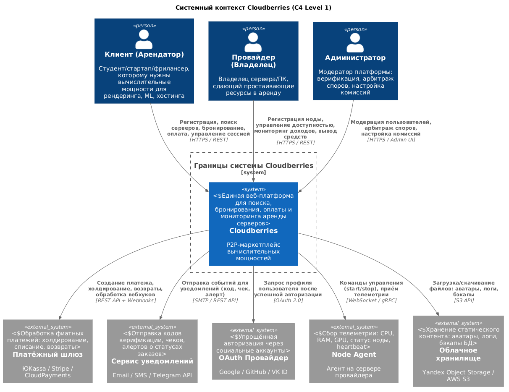
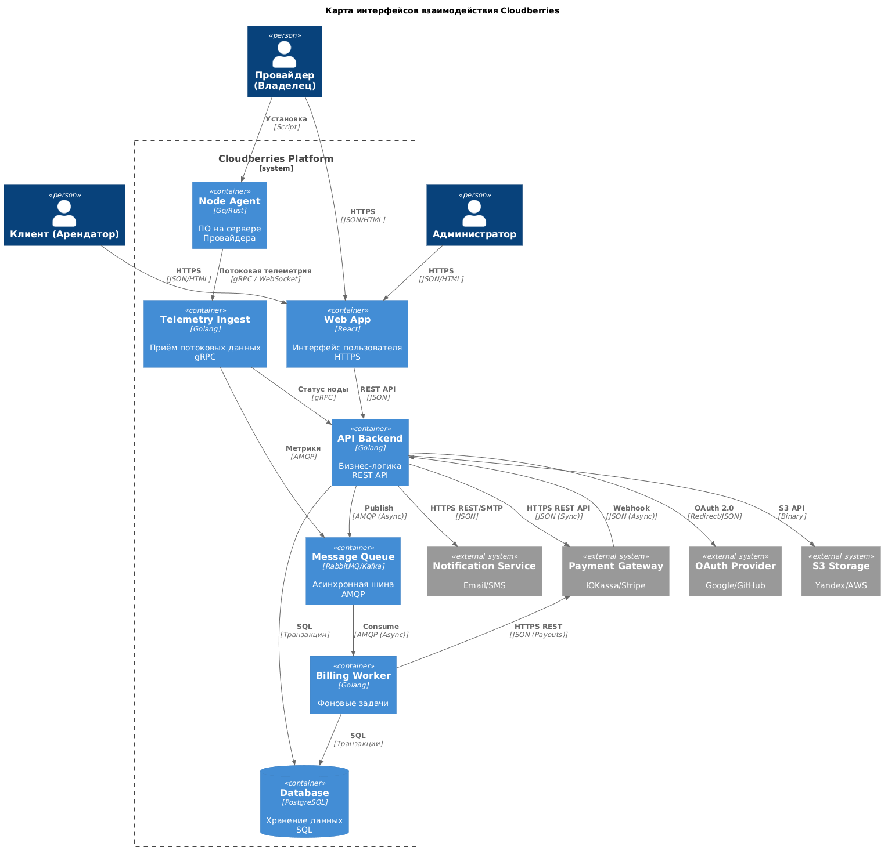

# 1. Системный контекст

## 1.1. Цель диаграммы контекста
Определить границы системы **Cloudberries** и явно указать все внешние сущности: пользователей (акторов) и внешние системы, с которыми происходит взаимодействие. Диаграмма отвечает на вопрос: *«Что находится внутри системы, а что — снаружи?»*

## 1.2. Диаграмма контекста


## 1.3. Описание элементов диаграммы

### Внутренняя система (в границах Cloudberries)

| Компонент | Описание |
|-----------|----------|
| **Cloudberries** | Единая веб-платформа (монолит на этапе MVP), обеспечивающая: поиск и фильтрацию серверов, бронирование с эскроу-оплатой, личные кабинеты, приём телеметрии, арбитраж споров. Объединяет клиентов и поставщиков в рамках защищённых сделок. |

### Внешние акторы

| Актор | Роль | Ключевые сценарии взаимодействия |
|-------|------|----------------------------------|
| **Клиент (Арендатор)** | Потребитель вычислительных мощностей | Регистрация → Поиск сервера → Бронирование → Оплата → Получение SSH-доступа → Управление сессией → Завершение аренды |
| **Провайдер (Владелец)** | Поставщик оборудования | Регистрация → Установка Node Agent → Публикация ноды в каталоге → Управление доступностью → Мониторинг доходов → Вывод средств |
| **Администратор** | Модератор и арбитр платформы | Верификация аккаунтов → Просмотр жалоб → Анализ логов телеметрии → Разрешение споров → Блокировка нарушителей |

### Внешние системы

| Система | Назначение | Протокол | Критичность |
|---------|------------|----------|-------------|
| **Платёжный шлюз** (ЮKassa / Stripe) | Обработка фиатных платежей: холдирование при бронировании, списание по факту, возвраты при сбое | REST API + Webhooks | Высокая |
| **Сервис уведомлений** (Email / SMS / Telegram) | Доставка кодов верификации, чеков, алертов о статусах заказов и балансе | SMTP / REST API | Средняя |
| **OAuth Провайдер** (Google / GitHub / VK) | Упрощённая регистрация и вход без создания нового пароля | OAuth 2.0 | Низкая |
| **Node Agent** (ПО на сервере провайдера) | Сбор телеметрии (CPU/RAM/GPU), отправка heartbeat, выполнение команд платформы (start/stop контейнера) | WebSocket / gRPC | Высокая |
| **Облачное хранилище** (S3-совместимое) | Хранение статического контента: аватары пользователей, скриншоты серверов, логи ошибок, бэкапы БД | S3 API | Средняя |

---

## 1.4. Границы системы (Scope) — что внутри, что снаружи

### Входит в зону ответственности Cloudberries
- Регистрация и верификация пользователей (клиент, провайдер, администратор)
- Каталог серверов с фильтрами, поиском и рейтинговой системой
- Логика бронирования: выбор периода, прозрачный калькулятор, корзина
- Управление жизненным циклом заказа (`pending → active → completed → cancelled`)
- Система эскроу-платежей: заморозка средств, поминутное списание, история транзакций
- Личные кабинеты: аналитика использования для клиента, статистика доходов для провайдера
- Приём и обработка телеметрии от Node Agent, мониторинг статуса нод, алерты
- Модерация контента, арбитраж споров, система репутации и блокировок
- Интеграция с внешними сервисами (платежи, уведомления, OAuth, S3)

### Не входит в зону ответственности Cloudberries
- Физическая инфраструктура провайдера (железо, сеть, электропитание, охлаждение)
- Обработка и хранение чувствительных платёжных данных (номера карт, CVV) — ответственность платёжного шлюза
- Доставка уведомлений конечному пользователю — ответственность внешнего сервиса (Email/SMS-провайдера)
- Аутентификация через социальные аккаунты — ответственность OAuth-провайдера
- Выполнение пользовательских задач (рендеринг, обучение моделей, хостинг) — ответственность клиента и провайдера
- Обеспечение аптайма и качества связи на стороне провайдера — платформа только фиксирует факты и влияет на рейтинг

---

# 2. Интерфейсы взаимодействия: структура данных, форматы и нагрузка

В данном разделе формализуются контракты обмена данными между системой **Cloudberries** и внешними сущностями, а также оцениваются параметры нагрузки для определения требований к пропускной способности каналов связи.

## 2.1. Основные сценарии обмена данными

| Сценарий | Направление | Протокол | Синхронно/Асинхронно | Объём данных (оценка) | Частота / Нагрузка (пик) |
|----------|-------------|----------|---------------------|---------------------|-------------------------|
| **Создание заказа** | Client → Cloudberries → Payment | REST (HTTPS) | Синхронно (с асинхронным вебхуком подтверждения) | ~2 КБ (запрос), ~1 КБ (ответ) | 10 заказов/мин, средняя: 2/мин |
| **Холдирование платежа** | Cloudberries → Payment | REST (HTTPS) | Синхронно | ~1.5 КБ | Аналогично созданию заказа |
| **Вебхук статуса платежа** | Payment → Cloudberries | Webhook (HTTPS) | Асинхронно | ~1 КБ | До 100 событий/час |
| **Телеметрия от ноды** | Node Agent → Cloudberries | WebSocket / gRPC | Асинхронно (push-модель) | ~500 Б/сообщение | 60 сообщений/мин/нода → при 1000 нод: ~30 МБ/мин |
| **Команда запуска контейнера** | Cloudberries → Node Agent | WebSocket / gRPC | Синхронно (ожидание ack) | ~2 КБ | До 10 команд/мин |
| **Отправка уведомления** | Cloudberries → Notifications | REST | Асинхронно (через очередь) | ~1 КБ | До 500 уведомлений/час пик |
| **Авторизация через OAuth** | Client ↔ Cloudberries ↔ OAuth | OAuth 2.0 (Redirect) | Синхронно (редиректы) | ~3 КБ/сессию | Низкая частота, только при входе |
| **Загрузка аватара/лога** | Cloudberries ↔ S3 | S3 API (REST) | Асинхронно | ~100 КБ – 10 МБ/файл | До 50 загрузок/час |

> 💡 **Вывод по нагрузке:** Основной трафик генерирует телеметрия от Node Agent (~30 МБ/мин при 1000 активных нод). Это требует асинхронной обработки метрик и горизонтального масштабирования приёмного шлюза (Ingest Service).

## 2.2. Форматы данных: контракты обмена

### 2.2.1. Платёжный шлюз (YooKassa / Stripe)

**Протокол:** REST API over HTTPS
**Формат:** Синхронный (REST API) для инициации платежа. Асинхронный (Webhooks) для подтверждения успешной оплаты или возврата (эскроу) 
**Сценарий:** Холдирование средств при бронировании сервера.

#### Запрос на создание платежа (Cloudberries → Payment Gateway)

```json
{
  "amount": {
    "value": "1500.00",
    "currency": "RUB"
  },
  "capture": false,
  "confirmation": {
    "type": "redirect",
    "return_url": "https://cloudberries.io/callback"
  },
  "idempotency_key": "8008f0e6-5595-428d-87d4-772c28563b11",
  "metadata": {
    "order_id": "ORD-998877",
    "client_id": "USR-12345"
  },
  "description": "Аренда сервера #ORD-998877 на 2 часа"
}
```

#### Ответ шлюза (Payment Gateway → Cloudberries)

```json
{
  "id": "22d6d597-000f-5000-9000-145f6df27d6f",
  "status": "waiting_for_capture",
  "paid": true,
  "amount": { "value": "1500.00", "currency": "RUB" },
  "created_at": "2026-05-13T10:05:00.000Z",
  "metadata": {
    "order_id": "ORD-998877"
  }
}
```

#### Вебхук уведомления о статусе (Асинхронный)

```json
{
  "event": "payment.succeeded",
  "object": {
    "id": "22d6d597-000f-5000-9000-145f6df27d6f",
    "status": "succeeded",
    "amount": { "value": "1500.00", "currency": "RUB" },
    "paid_at": "2026-05-13T10:07:30.000Z",
    "metadata": { "order_id": "ORD-998877" }
  }
}
```

### 2.2.2. Node Agent (Телеметрия и управление)

**Протокол:** Асинхронный (Двусторонний gRPC stream или WebSocket). Постоянное соединение для отправки heartbeat'ов и телеметрии, а также получения команд на старт/стоп контейнеров.<br>
**Формат:** Protobuf (gRPC) для минимального оверхеда и высокой скорости сериализации телеметрии.

#### Входящие данные: Телеметрия (Node Agent → Cloudberries)

```proto
message TelemetryUpdate {
  string node_id = 1;
  int64 timestamp = 2;
  float cpu_load_percent = 3;
  float ram_used_gb = 4;
  float gpu_load_percent = 5;
  enum NodeStatus { ONLINE = 0; BUSY = 1; ERROR = 2; }
  NodeStatus status = 6;
}
```

#### Исходящие данные: Команда управления (Cloudberries → Node Agent)
```json

{
  "command_id": "cmd-102938",
  "action": "start_container",
  "payload": {
    "order_id": "ORD-998877",
    "docker_image": "cloudberries/base-env:latest",
    "resources": {
      "cpus": 4,
      "memory_mb": 16384,
      "gpu": "RTX 3080"
    },
    "ssh_keys": ["ssh-rsa AAAAB3NzaC... user@cloudberries"],
    "expires_at": "2026-05-13T12:00:00Z"
  }
}
```

### 2.2.3. OAuth Провайдер (Google / GitHub)

**Протокол:** OAuth 2.0 (HTTP Redirect Flow)  
**Формат:** JSON (при обмене токенами и профилем)

#### Ответ профиля пользователя (User Info)

```json
{
  "sub": "110169484474386276334",
  "name": "Егор Белоусов",
  "given_name": "Егор",
  "family_name": "Белоусов",
  "email": "egor@example.com",
  "email_verified": true,
  "picture": "https://...photo.jpg"
}
```

### 2.2.4. Сервис уведомлений (Email / SMS / Telegram)

**Протокол:** REST API  
**Формат:** JSON

#### Запрос на отправку уведомления

```json
{
  "to": "+79001234567",
  "channel": "sms",
  "template_id": "verification_code",
  "variables": {
    "code": "4928",
    "ttl_minutes": 10
  },
  "priority": "high"
}
```

## 2.3. Требования к пропускной способности каналов

| Канал связи | Оценка пиковой нагрузки | Рекомендация по инфраструктуре |
|-------------|------------------------|-------------------------------|
| **Клиент ↔ API Gateway** | 200 одновременных соединений, ~50 запросов/сек | Балансировщик + 2-3 инстанса API, auto-scaling по CPU >70% |
| **Node Agent ↔ Telemetry Ingest** | 1000 нод × 1 сообщение/сек = 1000 сообщений/сек (~500 КБ/сек) | Выделенный микросервис ingest, очередь (Kafka/RabbitMQ), горизонтальное масштабирование |
| **Cloudberries ↔ Payment Gateway** | 50 транзакций/мин пик, ~1 КБ/транзакция | Стабильный канал, retry-логика, circuit breaker |
| **Cloudberries ↔ Database** | ~200 запросов/сек (чтение), ~20 запросов/сек (запись) | PostgreSQL с репликацией (1 master + 2 replica), connection pooling |
| **Cloudberries ↔ S3 Storage** | До 50 файлов/час, до 10 МБ/файл | Прямая загрузка через Presigned URLs, чтобы не нагружать API |

## 2.4. Паттерны надёжности и обработки ошибок

| Паттерн | Применение | Обоснование |
|---------|------------|-------------|
| **Idempotency Key** | Платежи, создание заказов | Защита от двойного списания при повторной отправке запроса из-за таймаута сети |
| **Circuit Breaker** | Вызовы внешних API (платежи, уведомления) | Предотвращение каскадных отказов: если шлюз не отвечает, система переходит в деградированный режим без блокировки всего API |
| **Retry with Backoff** | Вебхуки, отправка уведомлений | Автоматический повтор при временных сбоях сети с экспоненциальной задержкой |
| **Async Queue** | Обработка телеметрии, отправка писем | Декуплинг компонентов: приём данных не блокирует основной API, пиковые нагрузки сглаживаются очередью |
| **Eventual Consistency** | Статусы заказов, рейтинги | Для не-критичных данных допустима задержка синхронизации в несколько секунд ради производительности |

## 2.5. Диаграмма интерфейсов взаимодействия (Interface Map)



## 2.6. Таблица интерфейсов (Interface Catalog)

Здесь детализированы точки входа и выхода системы, чтобы закрыть требования к пропускной способности и форматам.

### Внешние интерфейсы (Public API)

| Источник → Приемник | Интерфейс | Протокол | Формат данных | Тип обмена | Описание нагрузки |
| :--- | :--- | :--- | :--- | :--- | :--- |
| **Браузер клиента** → **API Gateway** | User Interface API | HTTPS (TLS) | JSON | Синхронный | Высокая частота чтения (каталог, статусы). ~10-50 RPS на пользователя. |
| **Браузер провайдера** → **API Gateway** | Provider UI API | HTTPS (TLS) | JSON | Синхронный | Средняя частота. Управление нодами, вывод средств. |
| **Платежный шлюз** → **API Backend** | Payment Webhook | HTTPS (TLS) | JSON | Асинхронный | Низкая частота, но критична. Требует идемпотентности. |
| **Node Agent** → **Telemetry Ingest** | Agent Ingest API | gRPC | **Protobuf** (binary) | Асинхронный (Stream) | **Максимальная нагрузка:** 1000 нод × 1 сообщение/сек = 1000 msg/sec. |
| **API Backend** → **Платежный шлюз** | Merchant API | HTTPS (TLS) | JSON | Синхронный | Пиковая нагрузка при массовом бронировании. ~5-10 RPS. |

### Внутренние интерфейсы (Internal Communication)

| Источник → Приемник | Интерфейс | Протокол | Формат данных | Тип обмена | Описание нагрузки |
| :--- | :--- | :--- | :--- | :--- | :--- |
| **API Backend** → **Database** | Data Access | TCP (SSL) | Binary (SQL rows) | Синхронный | Основная нагрузка на запись при создании заказов. |
| **Ingest Service** → **Message Queue** | Metrics Stream | AMQP / Kafka | JSON/Protobuf | Асинхронный | Буферизация потоковой телеметрии для сглаживания пиков. |
| **Billing Worker** → **Database** | Billing Updates | TCP (SSL) | Binary (SQL rows) | Синхронный | Пакетная запись транзакций биллинга. |
| **API Backend** → **Notification** | Alerts API | HTTPS | JSON | Асинхронный (Fire & Forget) | Низкая нагрузка, зависит от событий (регистрация, ошибка). |

---

## 2.6. Характеристики каналов связи

Для обоснования выбора инфраструктуры:

1.  **Канал "Агент → Платформа" (Самый нагруженный):**
    *   *Протокол:* gRPC (HTTP/2) с использованием Protobuf.
    *   *Обоснование:* JSON был бы слишком "тяжелым" (лишние ключи, строковые метки). Protobuf уменьшает размер полезной нагрузки на **~60-70%**, что критично при тысячах нод, шлющих данные каждую секунду.
    *   *Нагрузка:* ~500 Кбит/сек на 1000 нод (очень мало, но требует обработки высокого количества пакетов).

2.  **Канал "Пользователь → Платформа":**
    *   *Протокол:* REST API (JSON).
    *   *Обоснование:* Стандарт для веб-интерфейсов (React), легко отлаживается, хорошая документация (Swagger).
    *   *Нагрузка:* Низкая (текстовые запросы), ограничение накладывается на CPU сервера (шифрование TLS), а не на полосу пропускания.

---

