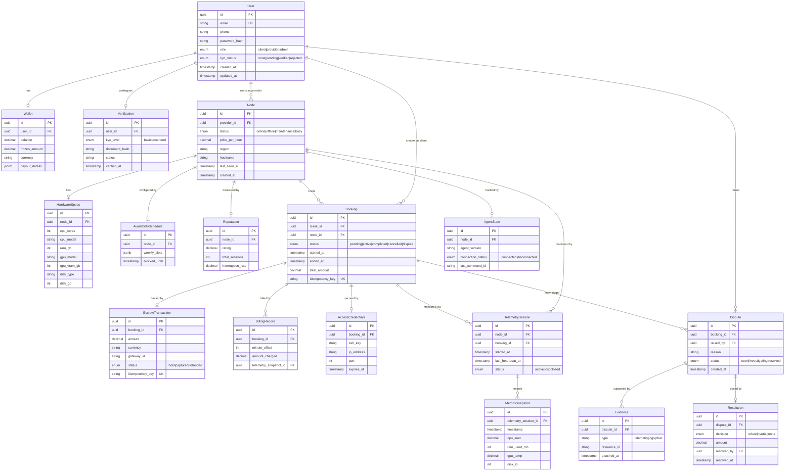
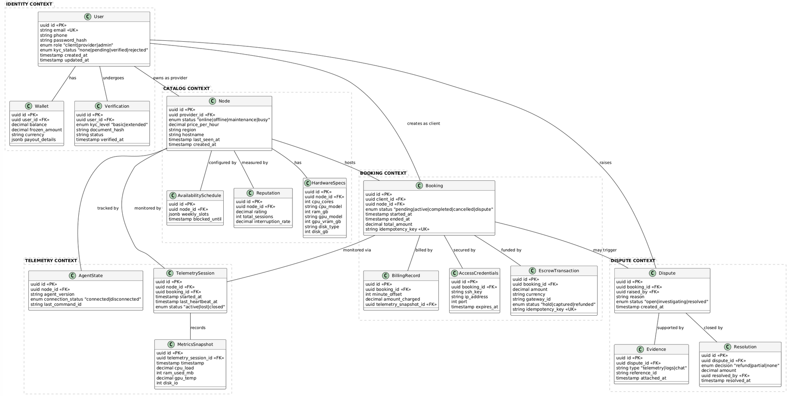
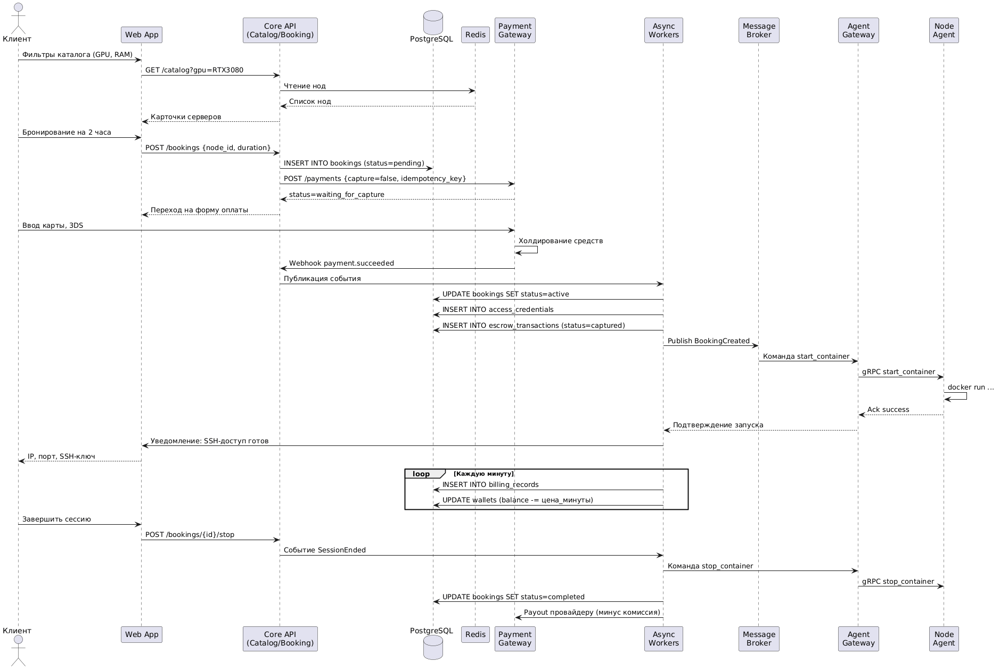
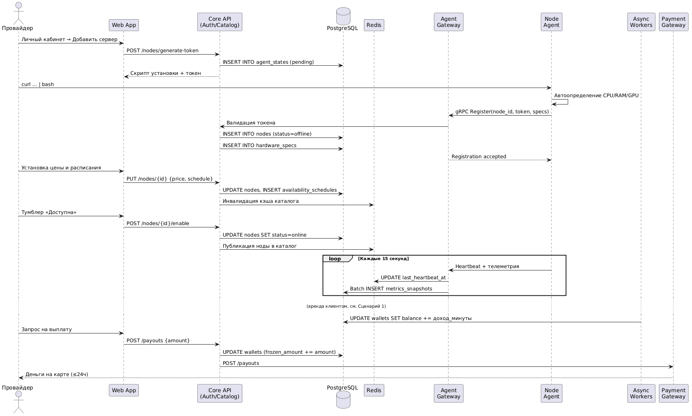
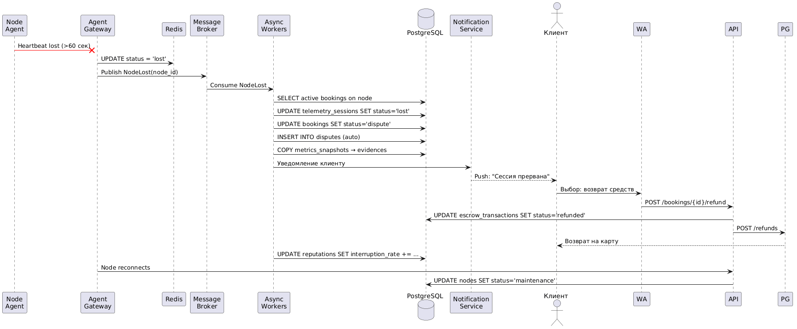

# Структура Итерации 5
Прежде чем писать, мы разбили задание на 6 логических пунктов. Это позволит нам двигаться поэтапно и не упустить требования:<br>
| № | Пункт | Что делаем |
|---|-------|------------|
| **1** | **Концептуальная модель предметной области** | Ключевые сущности, агрегаты, границы контекстов (DDD-lite), диаграмма |
| **2** | **Логическая модель данных (ER-диаграмма)** | Таблицы, связи, атрибуты, типы данных |
| **3** | **Трассировка модели на бизнес-требования** | Матрица: какая сущность закрывает какое требование из Итерации 2/3 |
| **4** | **Ключевые сценарии использования** | 3-4 основных happy path с привязкой к данным и архитектуре |
| **5** | **Сценарии с ошибками (Error Scenarios)** | Что происходит при сбоях: отключение агента, падение шлюза, спор |
| **6** | **Сценарии развития системы** | Как модель данных эволюционирует: v2.0, новые фичи, масштабирование |

# 1. Концептуальная модель предметной области

## 1.1. Границы контекстов (Bounded Contexts)

Модель предметной области Cloudberries разделена на **4 логических контекста**, каждый из которых решает свою бизнес-задачу. Это DDD-lite подход, согласованный с модульным монолитом из Итерации 4.


### Почему 4 контекста?
- **Identity & Access** — отвечает за требования **А3 (Time-to-Value)** и **Trust & KYC**
#### Требование А3: Скорость получения доступа (Time-to-Value)
| Параметр | Формализация |
|:---|:---|
| **Описание** | Минимизация времени от момента принятия решения об аренде до получения доступа к серверу (SSH/RDP/веб-терминал). |
| **Бизнес-обоснование** | В задачах рендеринга, обучения моделей или дедлайнов время — деньги. Долгая настройка сервера убивает продуктивность и мотивацию пользователя. |
| **Ключевые показатели (KPI)** | • `Time-to-SSH` ≤ 3 минут (p95) от успешной оплаты до получения ключей доступа<br>• `Onboarding Completion Rate` ≥ 80% (пользователи, завершившие регистрацию и первую аренду) |
| **Критерии достижения** | • Процесс бронирования занимает не более 3-х кликов после выбора сервера<br>• Автоматическая настройка окружения: Docker-контейнер поднимается сам, пользователю не нужно инсталлировать зависимости вручную |
| **Метод измерения** | Event-tracking (Mixpanel/Amplitude): замер времени между событиями `payment_success` → `ssh_credentials_delivered`, логи API деплоя |
| **Риски при невыполнении** | Пользователи не доходят до запуска задачи, высокий отток на этапе «получения доступа», негативные отзывы о сложности платформы |

- **Catalog & Discovery** — отвечает за требования **А1 (Cost-Efficiency)** и **П1 (Asset Utilization)**
#### Требование А1: Экономическая выгода (Cost-Efficiency)
| Параметр | Формализация |
|:---|:---|
| **Описание** | Получение вычислительных мощностей по стоимости, значительно ниже рыночных показателей крупных облачных провайдеров (AWS, GCP, RunPod). |
| **Бизнес-обоснование** | Целевая аудитория ограничена в бюджете. Если цена не будет конкурентной, смысл использования P2P-маркетплейса теряется — пользователи останутся на бесплатных тарифах или выберут более дешёвые аналоги. |
| **Ключевые показатели (KPI)** | • `Price Delta vs Market` ≤ -40% (средняя цена аренды на платформе ниже аналогов)<br>• `Cost per Compute Unit` (за 1 vCPU/GPU-час) ниже эталона рынка |
| **Критерии достижения** | • Калькулятор на сайте показывает итоговую сумму, которая гарантированно ниже цен конкурентов при равных характеристиках (визуальное сравнение)<br>• Отсутствие скрытых платежей (за трафик, IP, диски) в итоговом чеке — 100% прозрачность |
| **Метод измерения** | Парсинг цен конкурентов (AWS Calculator, Vast.ai API), A/B-тесты калькулятора, аналитика конверсии на этапе выбора тарифа |
| **Риски при невыполнении** | Низкая конверсия в оплату, высокий churn на этапе сравнения цен, невозможность набрать критическую массу арендаторов → сетевой эффект не запускается |

- **Booking & Escrow** — ядро платформы, отвечает за **Trust & Escrow** и **Billing Automation**
#### Требование 3: Обеспечение безопасности и доверия к сделкам (Trust & Escrow)
**Описание:** Внедрить систему эскроу-платежей и верификации, гарантирующую сохранность средств клиента и своевременную выплату провайдеру только после фактического оказания услуги.

| Параметр | Формализация |
|:---|:---|
| **Бизнес-обоснование** | В P2P-модели доверие — ключевой актив. Без гарантий обе стороны будут бояться мошенничества. Эскроу снижает арбитраж и повышает retention. |
| **Ключевые показатели (KPI)** | • `Successful Sessions Rate` ≥ 95%<br>• `Arbitration Rate` ≤ 3%<br>• `Dispute Resolution Time` ≤ 24 ч<br>• `Verification Pass Rate` ≥ 80% |
| **Критерии достижения** | • 95% аренд завершаются без обращения в поддержку/арбитраж<br>• Не более 3% транзакций требуют ручного вмешательства модератора<br>• Среднее время закрытия спора не превышает 24 часов с момента создания тикета<br>• 80% пользователей проходят KYC/Email+Phone верификацию без отвалов |
| **Метод измерения** | Метрики тикет-системы, логи статусов заказов, отчёты из эскроу-модуля, конверсия воронки верификации |
| **Риски при невыполнении** | Волна chargeback'ов, блокировка платёжного шлюза, репутационный ущерб, отток поставщиков из-за невыплат, юридические риски |

- **Telemetry & Sessions** — отвечает за **SLA Assurance** и **Host Security**

---

## 1.2. Ключевые сущности и агрегаты

### Агрегат 1: **User** (Корень агрегата в Identity Context)
| Сущность | Роль | Ключевые атрибуты |
|----------|------|-------------------|
| `User` | Корень агрегата | id, email, phone, role (Client/Provider/Admin), kyc_status, created_at |
| `Wallet` | Встроенная сущность | balance, frozen_amount, currency, payout_details |
| `Verification` | Встроенная сущность | kyc_level, documents_hash, verified_at |

**Связь с требованиями:**
- Закрывает **User Story 1.1** (регистрация) и **US-5.1** (низкий порог входа)
- Реализует бизнес-цель **Trust & Escrow** через KYC-уровни

### Агрегат 2: **Node** (Корень агрегата в Catalog Context)
| Сущность | Роль | Ключевые атрибуты |
|----------|------|-------------------|
| `Node` | Корень агрегата | id, provider_id, status (Online/Offline/Maintenance), price_per_hour, region |
| `HardwareSpecs` | Value Object | cpu_cores, ram_gb, gpu_model, gpu_vram_gb, disk_type, disk_gb |
| `AvailabilitySchedule` | Встроенная сущность | timezone, weekly_slots[], blocked_until |
| `Reputation` | Встроенная сущность | rating (0-5), total_sessions, interruption_rate |

**Связь с требованиями:**
- Закрывает **US-1.1** (фильтрация по GPU/CPU) и **US-2.1** (установка агента)
- Реализует **П1 (Asset Utilization)** через гибкое расписание
- Реализует **П2 (Host Security)** через изоляцию на уровне Node


### Агрегат 3: **Booking** (Корень агрегата в Booking Context) — **ЦЕНТРАЛЬНЫЙ АГРЕГАТ**
| Сущность | Роль | Ключевые атрибуты |
|----------|------|-------------------|
| `Booking` | Корень агрегата | id, client_id, node_id, status (Pending/Active/Completed/Cancelled/Dispute), started_at, ended_at |
| `EscrowTransaction` | Встроенная сущность | amount, currency, gateway_id, status (Hold/Captured/Refunded), idempotency_key |
| `BillingRecord[]` | Встроенные сущности | minute_offset, amount_charged, telemetry_snapshot_id |
| `AccessCredentials` | Value Object | ssh_key, ip_address, port, expires_at |

**State Machine статуса Booking:**


**Связь с требованиями:**
- Закрывает **US-1.2** (прозрачный калькулятор), **US-1.3** (мгновенный доступ)
- Реализует **Требование 3 (Trust & Escrow)** — ключевой агрегат для безопасности сделок
- Реализует **Требование 4 (Billing Automation)** через BillingRecord


### Агрегат 4: **TelemetrySession** (Корень агрегата в Telemetry Context)
| Сущность | Роль | Ключевые атрибуты |
|----------|------|-------------------|
| `TelemetrySession` | Корень агрегата | id, node_id, booking_id, started_at, last_heartbeat_at |
| `MetricsSnapshot[]` | Встроенные сущности | timestamp, cpu_load, ram_used_mb, gpu_temp, disk_io |
| `AgentState` | Встроенная сущность | agent_version, connection_status, last_command_id |

**Связь с требованиями:**
- Закрывает **US-3.2** (сбор телеметрии) и **US-3.1** (эскроу)
- Реализует **А4 (SLA Assurance)** — данные телеметрии используются для разрешения споров
- Реализует **П2 (Host Security)** — контроль за сессиями


### Агрегат 5: **Dispute** (Корень агрегата в Booking Context)
| Сущность | Роль | Ключевые атрибуты |
|----------|------|-------------------|
| `Dispute` | Корень агрегата | id, booking_id, raised_by, reason, status (Open/Investigating/Resolved) |
| `Evidence` | Встроенная сущность | type (telemetry/logs/chat), reference_id, attached_at |
| `Resolution` | Value Object | decision (refund/partial/none), amount, resolved_by, resolved_at |

**Связь с требованиями:**
- Закрывает **US-3.1** (арбитраж для админа)
- Реализует **Trust & Escrow** — финальная линия защиты доверия

## 1.3. Диаграмма связей между агрегатами


## 1.4. Связь модели с высокоуровневыми требованиями

| Бизнес-требование (Итерация 2-3) | Отвечающий агрегат | Ключевые сущности | Как модель обеспечивает требование |
|----------------------------------|--------------------|--------------------|-------------------------------------|
| **Supply Growth** (П1, монетизация) | `Node` | AvailabilitySchedule, Reputation | Гибкое расписание + рейтинг стимулируют провайдеров |
| **Demand Activation** (А1, А2, А3) | `Booking` + `Node` | EscrowTransaction, AccessCredentials | Прозрачная цена + мгновенный SSH-доступ |
| **Trust & Escrow** (Требование 3) | `Booking` + `Dispute` | EscrowTransaction, Evidence | Холдирование средств + арбитраж на основе телеметрии |
| **Billing Automation** (Требование 4) | `Booking` + `TelemetrySession` | BillingRecord, MetricsSnapshot | Поминутное списание привязано к реальным метрикам |
| **Host Security** (П2) | `TelemetrySession` | AgentState, MetricsSnapshot | Изоляция сессий + контроль heartbeat |
| **SLA Assurance** (А4) | `TelemetrySession` + `Dispute` | MetricsSnapshot, Evidence | Объективные данные для разрешения споров |

---

## 1.5. Ключевые концептуальные решения

### Решение 1: **Booking как центральный агрегат**
Все финансовые операции, доступы и состояния сессии инкапсулированы в одном агрегате. Это обеспечивает **ACID-транзакции** в PostgreSQL без распределённых саг — что напрямую соответствует архитектурному решению из Итерации 4 (модульный монолит).

### Решение 2: **BillingRecord как массив внутри Booking**
Поминутные записи биллинга хранятся как embedded-коллекция, а не отдельная таблица. Это:
- Гарантирует консистентность с Booking
- Упрощает аудит и разрешение споров
- Соответствует паттерну **Exactly-once billing** из NFR

### Решение 3: **TelemetrySession отделена от Booking**
Высокочастотные метрики (1000 msg/sec) изолированы в отдельном контексте. Это:
- Защищает основную БД от write-heavy нагрузки
- Соответствует решению "Agent Gateway как отдельный контейнер"
- Позволяет хранить метрики в Redis/TSDB, а в Postgres — только snapshot'ы для споров

### Решение 4: **Dispute использует Evidence как snapshot**
При открытии спора система делает snapshot телеметрии за период аренды. Это:
- Защищает данные от удаления/изменения
- Даёт администратору объективную картину
- Реализует KPI `Dispute Resolution Time ≤ 24ч`

# 2. Логическая модель данных (ER-диаграмма)

В данном разделе концептуальная модель предметной области (п. 1) трансформируется в **логическую модель данных** — набор сущностей, атрибутов и связей, готовых к реализации в реляционной СУБД PostgreSQL. Модель спроектирована с учётом:
- **ACID-требований** для финансовых операций (эскроу, биллинг)
- **Write-heavy нагрузки** телеметрии (~1000 msg/sec)
- **Read-heavy нагрузки** каталога (поиск и фильтрация нод)
- **Требований 152-ФЗ** к хранению персональных данных


## 2.1. ER-диаграмма (Mermaid)

ER-диаграмма (PlantUML)


## 2.2. Детальное описание таблиц

### Identity Context

#### `users`
| Атрибут | Тип PostgreSQL | Ограничения | Описание |
|---------|----------------|-------------|----------|
| `id` | `UUID` | PK, DEFAULT gen_random_uuid() | Уникальный идентификатор пользователя |
| `email` | `VARCHAR(255)` | UNIQUE, NOT NULL | Email для входа и уведомлений |
| `phone` | `VARCHAR(20)` | — | Телефон для 2FA и KYC |
| `password_hash` | `VARCHAR(255)` | — | Хэш пароля (bcrypt/argon2) |
| `role` | `ENUM('client','provider','admin')` | NOT NULL | Роль в системе |
| `kyc_status` | `ENUM('none','pending','verified','rejected')` | DEFAULT 'none' | Статус верификации |
| `created_at` | `TIMESTAMPTZ` | DEFAULT now() | Дата регистрации |
| `updated_at` | `TIMESTAMPTZ` | DEFAULT now() | Дата последнего изменения |

**Индексы:** `idx_users_email` (unique), `idx_users_role`, `idx_users_kyc_status`

---

#### `wallets`
| Атрибут | Тип | Ограничения | Описание |
|---------|-----|-------------|----------|
| `id` | `UUID` | PK | Идентификатор кошелька |
| `user_id` | `UUID` | FK → users.id, UNIQUE | Владелец кошелька (1:1) |
| `balance` | `DECIMAL(12,2)` | CHECK (balance >= 0) | Доступный баланс |
| `frozen_amount` | `DECIMAL(12,2)` | CHECK (frozen_amount >= 0) | Замороженные средства (эскроу) |
| `currency` | `CHAR(3)` | DEFAULT 'RUB' | Валюта кошелька |
| `payout_details` | `JSONB` | — | Реквизиты для вывода (карта/счёт) |

**Индексы:** `idx_wallets_user_id` (unique)

**Обоснование типов:** `DECIMAL(12,2)` вместо `FLOAT` исключает ошибки округления при финансовых операциях. `JSONB` для реквизитов позволяет хранить разнородные данные (карта, банковский счёт, крипто-адрес) без изменения схемы.

---

#### `verifications`
| Атрибут | Тип | Ограничения | Описание |
|---------|-----|-------------|----------|
| `id` | `UUID` | PK | Идентификатор верификации |
| `user_id` | `UUID` | FK → users.id | Пользователь |
| `kyc_level` | `ENUM('basic','extended')` | NOT NULL | Уровень проверки |
| `document_hash` | `VARCHAR(64)` | — | Хэш загруженного документа (SHA-256) |
| `status` | `ENUM('pending','approved','rejected')` | DEFAULT 'pending' | Статус проверки |
| `verified_at` | `TIMESTAMPTZ` | — | Дата подтверждения |

**Индексы:** `idx_verifications_user_id`, `idx_verifications_status`

**Безопасность:** Сами документы не хранятся в БД — только хэш. Оригиналы загружаются в S3 с шифрованием.

---

### Catalog Context

#### `nodes`
| Атрибут | Тип | Ограничения | Описание |
|---------|-----|-------------|----------|
| `id` | `UUID` | PK | Идентификатор ноды |
| `provider_id` | `UUID` | FK → users.id | Владелец ноды |
| `status` | `ENUM('online','offline','maintenance','busy')` | NOT NULL | Текущий статус |
| `price_per_hour` | `DECIMAL(8,2)` | CHECK (price > 0) | Цена аренды в час |
| `region` | `VARCHAR(50)` | — | Географический регион |
| `hostname` | `VARCHAR(255)` | UNIQUE | Уникальное имя ноды |
| `last_seen_at` | `TIMESTAMPTZ` | — | Время последнего heartbeat |
| `created_at` | `TIMESTAMPTZ` | DEFAULT now() | Дата добавления |

**Индексы:** `idx_nodes_provider_id`, `idx_nodes_status`, `idx_nodes_region`, `idx_nodes_price_per_hour`, `idx_nodes_last_seen_at`

---

#### `hardware_specs`
| Атрибут | Тип | Описание |
|---------|-----|----------|
| `id` | `UUID` | PK |
| `node_id` | `UUID` | FK → nodes.id (1:1) |
| `cpu_cores` | `INT` | Количество ядер CPU |
| `cpu_model` | `VARCHAR(100)` | Модель процессора |
| `ram_gb` | `INT` | Объём RAM в ГБ |
| `gpu_model` | `VARCHAR(100)` | Модель GPU (nullable) |
| `gpu_vram_gb` | `INT` | Объём VRAM (nullable) |
| `disk_type` | `ENUM('hdd','ssd','nvme')` | Тип диска |
| `disk_gb` | `INT` | Объём диска в ГБ |

**Индексы:** `idx_specs_node_id` (unique), `idx_specs_gpu_model`, `idx_specs_ram_gb`

**Обоснование:** Вынесено в отдельную таблицу для нормализации — характеристики меняются реже, чем статус ноды.

---

#### `availability_schedules`
| Атрибут | Тип | Описание |
|---------|-----|----------|
| `id` | `UUID` | PK |
| `node_id` | `UUID` | FK → nodes.id (1:1) |
| `weekly_slots` | `JSONB` | Расписание: `{"mon": [0,480], "tue": [0,480], ...}` (минуты с начала дня) |
| `blocked_until` | `TIMESTAMPTZ` | Временная блокировка (например, для личных нужд) |

---

#### `reputations`
| Атрибут | Тип | Описание |
|---------|-----|----------|
| `id` | `UUID` | PK |
| `node_id` | `UUID` | FK → nodes.id (1:1) |
| `rating` | `DECIMAL(2,1)` | Средний рейтинг 0.0–5.0 |
| `total_sessions` | `INT` | Количество завершённых сессий |
| `interruption_rate` | `DECIMAL(5,4)` | Доля прерванных сессий (0.0000–1.0000) |

---

### Booking Context (Центральный агрегат)

#### `bookings`
| Атрибут | Тип | Ограничения | Описание |
|---------|-----|-------------|----------|
| `id` | `UUID` | PK | Идентификатор бронирования |
| `client_id` | `UUID` | FK → users.id | Арендатор |
| `node_id` | `UUID` | FK → nodes.id | Арендуемая нода |
| `status` | `ENUM('pending','active','completed','cancelled','dispute')` | NOT NULL | Статус заказа |
| `started_at` | `TIMESTAMPTZ` | — | Начало аренды |
| `ended_at` | `TIMESTAMPTZ` | — | Конец аренды (NULL если активна) |
| `total_amount` | `DECIMAL(10,2)` | — | Итоговая сумма |
| `idempotency_key` | `VARCHAR(64)` | UNIQUE | Ключ идемпотентности для защиты от дублей |

**Индексы:** `idx_bookings_client_id`, `idx_bookings_node_id`, `idx_bookings_status`, `idx_bookings_started_at`, `idx_bookings_idempotency_key` (unique)

---

#### `escrow_transactions`
| Атрибут | Тип | Описание |
|---------|-----|----------|
| `id` | `UUID` | PK |
| `booking_id` | `UUID` | FK → bookings.id |
| `amount` | `DECIMAL(10,2)` | Сумма транзакции |
| `currency` | `CHAR(3)` | Валюта |
| `gateway_id` | `VARCHAR(100)` | ID транзакции в платёжном шлюзе |
| `status` | `ENUM('hold','captured','refunded')` | Статус эскроу |
| `idempotency_key` | `VARCHAR(64)` | Уникальный ключ |

**Индексы:** `idx_escrow_booking_id`, `idx_escrow_gateway_id`, `idx_escrow_idempotency_key` (unique)

---

#### `billing_records`
| Атрибут | Тип | Описание |
|---------|-----|----------|
| `id` | `UUID` | PK |
| `booking_id` | `UUID` | FK → bookings.id |
| `minute_offset` | `INT` | Минута с начала аренды |
| `amount_charged` | `DECIMAL(8,4)` | Сумма за минуту |
| `telemetry_snapshot_id` | `UUID` | FK → metrics_snapshots.id (nullable) |

**Индексы:** `idx_billing_booking_id`, `idx_billing_minute_offset`

**Обоснование:** Встроены в Booking как embedded-коллекция (логически), но физически — отдельная таблица для возможности пакетной записи и эффективного аудита.

---

#### `access_credentials`
| Атрибут | Тип | Описание |
|---------|-----|----------|
| `id` | `UUID` | PK |
| `booking_id` | `UUID` | FK → bookings.id (1:1) |
| `ssh_key` | `TEXT` | Публичный SSH-ключ клиента |
| `ip_address` | `INET` | IP-адрес ноды |
| `port` | `INT` | Порт SSH |
| `expires_at` | `TIMESTAMPTZ` | Время истечения доступа |

**Индексы:** `idx_credentials_booking_id` (unique)

---

### Telemetry Context

#### `telemetry_sessions`
| Атрибут | Тип | Описание |
|---------|-----|----------|
| `id` | `UUID` | PK |
| `node_id` | `UUID` | FK → nodes.id |
| `booking_id` | `UUID` | FK → bookings.id |
| `started_at` | `TIMESTAMPTZ` | Начало сессии |
| `last_heartbeat_at` | `TIMESTAMPTZ` | Последний heartbeat |
| `status` | `ENUM('active','lost','closed')` | Статус сессии |

**Индексы:** `idx_telemetry_node_id`, `idx_telemetry_booking_id`, `idx_telemetry_status`

---

#### `metrics_snapshots`
| Атрибут | Тип | Описание |
|---------|-----|----------|
| `id` | `UUID` | PK |
| `telemetry_session_id` | `UUID` | FK → telemetry_sessions.id |
| `timestamp` | `TIMESTAMPTZ` | Время замера |
| `cpu_load` | `DECIMAL(5,2)` | Загрузка CPU в % |
| `ram_used_mb` | `INT` | Использовано RAM в МБ |
| `gpu_temp` | `DECIMAL(5,2)` | Температура GPU в °C |
| `disk_io` | `INT` | Дисковый I/O в МБ/с |

**Индексы:** `idx_metrics_session_id`, `idx_metrics_timestamp`

**Обоснование:** Это **write-heavy таблица** (~1000 записей/сек). В production рекомендуется:
- Партиционирование по `timestamp` (месячные партиции)
- Отдельный tablespace на быстром SSD
- Агрегация сырых данных в hourly/daily rollups через материализованные представления

---

#### `agent_states`
| Атрибут | Тип | Описание |
|---------|-----|----------|
| `id` | `UUID` | PK |
| `node_id` | `UUID` | FK → nodes.id (1:1) |
| `agent_version` | `VARCHAR(20)` | Версия Node Agent |
| `connection_status` | `ENUM('connected','disconnected')` | Статус соединения |
| `last_command_id` | `VARCHAR(64)` | ID последней команды |

---

### Dispute Context

#### `disputes`
| Атрибут | Тип | Описание |
|---------|-----|----------|
| `id` | `UUID` | PK |
| `booking_id` | `UUID` | FK → bookings.id |
| `raised_by` | `UUID` | FK → users.id (кто открыл спор) |
| `reason` | `TEXT` | Описание проблемы |
| `status` | `ENUM('open','investigating','resolved')` | Статус спора |
| `created_at` | `TIMESTAMPTZ` | Дата открытия |

**Индексы:** `idx_disputes_booking_id`, `idx_disputes_status`, `idx_disputes_created_at`

---

#### `evidences`
| Атрибут | Тип | Описание |
|---------|-----|----------|
| `id` | `UUID` | PK |
| `dispute_id` | `UUID` | FK → disputes.id |
| `type` | `ENUM('telemetry','logs','chat')` | Тип доказательства |
| `reference_id` | `VARCHAR(100)` | Ссылка на источник (ID снапшота, лога) |
| `attached_at` | `TIMESTAMPTZ` | Дата прикрепления |

---

#### `resolutions`
| Атрибут | Тип | Описание |
|---------|-----|----------|
| `id` | `UUID` | PK |
| `dispute_id` | `UUID` | FK → disputes.id (1:1) |
| `decision` | `ENUM('refund','partial','none')` | Решение |
| `amount` | `DECIMAL(10,2)` | Сумма возврата |
| `resolved_by` | `UUID` | FK → users.id (администратор) |
| `resolved_at` | `TIMESTAMPTZ` | Дата закрытия |

---

## 2.3. Ключевые архитектурные решения модели

### Решение 1: UUID вместо SERIAL
Все первичные ключи — `UUID` (генерируются на клиенте через `gen_random_uuid()`). Это:
- Исключает конфликты при репликации БД
- Позволяет создавать записи без обращения к БД (важно для распределённых систем)
- Затрудняет enumeration-атаки (нельзя угадать ID следующего заказа)

### Решение 2: DECIMAL для финансовых данных
Все денежные суммы — `DECIMAL(10,2)` или `DECIMAL(12,2)`, **никогда FLOAT**. Это исключает ошибки округления при поминутном биллинге и расчёте комиссий.

### Решение 3: JSONB для гибких структур
`JSONB` используется для:
- `wallets.payout_details` — разнородные реквизиты
- `availability_schedules.weekly_slots` — расписание
- `hardware_specs` (потенциально) — для новых типов железа без миграций

JSONB индексируется через GIN, что позволяет эффективно искать по вложенным полям.

### Решение 4: Idempotency Key на уровне БД
Поля `idempotency_key` с UNIQUE-ограничением в `bookings` и `escrow_transactions` — это **последняя линия защиты** от двойных списаний. Даже если приложение отправит запрос дважды, БД отклонит дубликат.

### Решение 5: Разделение TelemetrySession и MetricsSnapshot
Сырые метрики (высокочастотные) отделены от сессий (низкочастотные). Это позволяет:
- Партиционировать `metrics_snapshots` по времени
- Архивировать старые метрики без влияния на бизнес-данные
- Использовать разные стратегии бэкапа

---

## 2.4. Связь модели с бизнес-требованиями (трассировка)

| Бизнес-требование (Итерация 2-3) | Отвечающие таблицы | Как модель обеспечивает требование |
|----------------------------------|--------------------|-------------------------------------|
| **Supply Growth** (монетизация) | `nodes`, `availability_schedules`, `reputations` | Гибкое расписание + рейтинг стимулируют провайдеров подключать оборудование |
| **Demand Activation** (доступность) | `nodes`, `hardware_specs`, `bookings` | Фильтрация по характеристикам + мгновенное создание брони |
| **Trust & Escrow** (безопасность) | `bookings`, `escrow_transactions`, `wallets` | Холдирование средств + UNIQUE idempotency_key + CHECK-ограничения |
| **Billing Automation** | `billing_records`, `telemetry_sessions`, `metrics_snapshots` | Поминутное списание привязано к реальным метрикам |
| **Host Security** | `telemetry_sessions`, `agent_states`, `access_credentials` | Изоляция сессий + контроль heartbeat + SSH-ключи вместо паролей |
| **SLA Assurance** | `metrics_snapshots`, `disputes`, `evidences` | Объективные данные для разрешения споров (KPI: Dispute Resolution ≤ 24ч) |
| **152-ФЗ Compliance** | `users`, `verifications` | Хэширование паролей, хранение только хэшей документов, шифрование полей |
| **PCI DSS** | `wallets`, `escrow_transactions` | Никаких данных карт — только `gateway_id` от платёжного шлюза |


# 3. Трассировка модели данных на бизнес-требования

В данном разделе демонстрируется, как спроектированная логическая модель данных (Пункт 2) напрямую поддерживает и гарантирует выполнение бизнес-требований, сформулированных в Итерациях 2 и 3. 

Цель трассировки — показать, что ключевые бизнес-правила (безопасность сделок, прозрачность биллинга, соответствие регуляторным нормам) зашиты не только в код приложения, но и **принудительно enforced на уровне схемы базы данных** через ограничения (Constraints), индексы и связи.

## 3.1. Матрица сквозной трассировки (Business Requirements ↔ Data Model)

| Бизнес-требование (Итерация 2-3) | Ключевые сущности БД | Атрибуты и ограничения (Constraints) | Как модель данных обеспечивает требование |
|:---|:---|:---|:---|
| **Trust & Escrow**<br>*(Безопасность сделок, гарантия оплаты)* | `bookings`<br>`escrow_transactions`<br>`wallets` | • `status` ENUM ('pending','active','completed')<br>• `idempotency_key` (UNIQUE)<br>• `CHECK (balance >= 0)` и `CHECK (frozen_amount >= 0)` в `wallets` | Уникальный ключ идемпотентности на уровне БД физически предотвращает двойное списание. CHECK-ограничения не позволяют уйти в минус. Статусы заказа жестко контролируют переход средств из холда в капчу. |
| **Billing Automation**<br>*(Прозрачный поминутный биллинг)* | `billing_records`<br>`metrics_snapshots`<br>`telemetry_sessions` | • `minute_offset` (INT)<br>• `amount_charged` (DECIMAL)<br>• FK `telemetry_snapshot_id` (nullable) | Каждая запись биллинга жестко привязана к снапшоту телеметрии. Это обеспечивает принцип «оплата только за факт работы» и создает неизменяемый аудиторский след для разрешения споров. |
| **Supply Growth**<br>*(Монетизация и контроль для провайдера)* | `nodes`<br>`availability_schedules`<br>`reputations` | • `weekly_slots` (JSONB)<br>• `blocked_until` (TIMESTAMPTZ)<br>• `interruption_rate` (DECIMAL) | Гибкое JSONB-расписание позволяет провайдеру сдавать сервер только в свободное время. Поле `blocked_until` дает возможность экстренно забрать сервер без удаления ноды из каталога. |
| **Demand Activation**<br>*(Быстрый поиск и доступность)* | `nodes`<br>`hardware_specs` | • Индексы: `idx_nodes_status`, `idx_nodes_region`, `idx_nodes_price_per_hour`<br>• Индексы: `idx_specs_gpu_model`, `idx_specs_ram_gb` | Вынесение характеристик в отдельную таблицу с индексами позволяет каталогу (и Redis) мгновенно фильтровать тысячи нод по GPU/RAM без Full Table Scan, сокращая Time-to-Value. |
| **PCI DSS Compliance**<br>*(Безопасность платежных данных)* | `wallets`<br>`escrow_transactions` | • `gateway_id` (VARCHAR)<br>• Отсутствие полей `card_number`, `cvv` | Модель данных физически не содержит чувствительных данных карт. Хранится только токен транзакции от шлюза, что сужает perimeter аудита PCI DSS. |
| **152-ФЗ / Data Privacy**<br>*(Защита персональных данных)* | `users`<br>`verifications` | • `password_hash` (вместо пароля)<br>• `document_hash` (SHA-256 вместо файла)<br>• `kyc_status` ENUM | Пароли и документы не хранятся в открытом виде. Хранение только хэшей документов снижает риски утечки ПДн и упрощает соблюдение законодательства. |
| **SLA Assurance**<br>*(Гарантии доступности и арбитраж)* | `telemetry_sessions`<br>`disputes`<br>`evidences` | • `last_heartbeat_at` (TIMESTAMPTZ)<br>• `status` ENUM ('active','lost','closed')<br>• FK связи между `disputes` и `evidences` | Разделение сессий и снапшотов позволяет хранить сырые метрики для арбитража, даже если основная сессия закрыта. Статус `lost` триггерит автоматические алерты. |

## 3.2. Детальный разбор ключевых механизмов enforcement

Чтобы показать глубину проработки, разберем три критичных бизнес-сценария и то, как именно схема БД защищает их от ошибок на уровне приложения.

### Механизм 1: Защита от двойного списания (Idempotency)
**Бизнес-проблема:** При сетевом сбое клиент может нажать кнопку «Оплатить» дважды, или вебхук от платежного шлюза может прийти дважды. Это приведет к двойному списанию и потере доверия.
**Решение в модели данных:**
```sql
ALTER TABLE escrow_transactions 
ADD CONSTRAINT uq_escrow_idempotency UNIQUE (idempotency_key);
```
**Как это работает:**
Даже если бэкенд по ошибке отправит два идентичных запроса на создание транзакции с одним и тем же UUID, PostgreSQL отклонит второй запрос на уровне движка БД. Это последняя линия обороны, гарантирующая Exactly-once semantics для финансовых операций.

### Механизм 2: Атомарность эскроу-транзакций (ACID)
**Бизнес-проблема:** При переводе средств с баланса клиента в эскроу (холдирование) система может упасть после списания у клиента, но до зачисления в холд. Деньги «исчезнут».
**Решение в модели данных:**
```sql
BEGIN;
  UPDATE wallets SET balance = balance - 1500.00 WHERE user_id = 'client_id' AND balance >= 1500.00;
  UPDATE wallets SET frozen_amount = frozen_amount + 1500.00 WHERE user_id = 'client_id';
  INSERT INTO escrow_transactions (...) VALUES (...);
COMMIT;
```
**Как это работает:** Использование реляционной БД (PostgreSQL) позволяет выполнить все три операции в рамках одной ACID-транзакции. CHECK-ограничение `balance >= 0` (реализованное через условие в UPDATE) предотвращает уход в овердрафт. В случае сбоя произойдет автоматический ROLLBACK.

### Механизм 3: Аудиторский след для арбитража (Audit Trail)
**Бизнес-проблема:** Провайдер утверждает, что сервер работал 2 часа, клиент — что он упал через 30 минут. Нужны объективные данные.
**Решение в модели данных:**
Таблица `billing_records` имеет внешний ключ на `metrics_snapshots`.
```sql
SELECT br.minute_offset, br.amount_charged, ms.cpu_load, ms.ram_used_mb
FROM billing_records br
JOIN metrics_snapshots ms ON br.telemetry_snapshot_id = ms.id
WHERE br.booking_id = 'ORD-998877'
ORDER BY br.minute_offset;
```
**Как это работает:** Модель данных принудительно связывает финансовую запись (сколько списали) с технической метрикой (что происходило на сервере в эту минуту). Это делает модель самодостаточной для разрешения 95% споров без привлечения дополнительных логов.


## 3.3. Влияние модели данных на нефункциональные требования (NFR)

Модель данных также напрямую диктует и поддерживает качественные характеристики системы (NFR), определенные в Итерации 4.

| Атрибут качества (NFR) | Элементы модели данных | Влияние на архитектуру |
|:---|:---|:---|
| **Производительность (Performance)** | Индексы по `status`, `region`, `price_per_hour` в таблице `nodes`. Партиционирование `metrics_snapshots` по времени. | Позволяет каталогу отдавать результаты поиска за ≤50 мс. Партиционирование предотвращает деградацию БД при росте таблицы метрик до миллиардов строк. |
| **Масштабируемость (Scalability)** | Использование `UUID` вместо `SERIAL` для Primary Keys. | Позволяет генерировать ID на клиенте/агенте без обращения к БД, что устраняет bottleneck при горизонтальном масштабировании API и Agent Gateway. |
| **Надёжность (Reliability)** | FOREIGN KEY с `ON DELETE RESTRICT` для `bookings` → `escrow_transactions`. | Запрещает случайное удаление заказа, если по нему уже есть финансовые транзакции. Обеспечивает ссылочную целостность (Referential Integrity). |
| **Расширяемость (Extensibility)** | Использование `JSONB` для `wallets.payout_details` и `availability_schedules.weekly_slots`. | Позволяет добавлять новые типы реквизитов для вывода средств или сложные расписания доступности без выполнения DDL-миграций и остановки сервиса. |


# 4. Ключевые сценарии использования системы

В данном разделе представлены три ключевых сценария, которые демонстрируют, как концептуальная архитектура (Итерация 4) и модель данных (пункты 1–2 Итерации 5) совместно реализуют основные бизнес-требования. Каждый сценарий включает:
- Основной поток (Happy Path) или поток обработки ошибки
- Sequence Diagram для визуализации взаимодействия компонентов
- Перечень задействованных сущностей модели данных
- Привязку к бизнес-требованиям и NFR
- Обоснование достижения качественных характеристик


## 4.1. Сценарий 1: Аренда сервера клиентом (Happy Path)

**Акторы:** Клиент (Арендатор), Система Cloudberries, Платёжный шлюз, Node Agent  
**Предусловия:** Клиент зарегистрирован и прошёл базовую верификацию (`kyc_status = 'verified'`), на кошельке достаточно средств или привязана карта.

### Основной поток

| Шаг | Действие | Компонент | Сущность БД |
|:---|:---|:---|:---|
| 1 | Клиент открывает каталог, применяет фильтры (GPU=RTX3080, RAM≥16GB) | Web App → Core API (`Catalog Service`) → Redis | `nodes`, `hardware_specs` (читаются из кэша Redis) |
| 2 | Клиент выбирает ноду, указывает длительность (2 часа), видит итоговую цену с комиссией | Core API (`Booking Service`) | `nodes.price_per_hour` |
| 3 | Клиент подтверждает бронирование | Core API (`Booking Service`) | — |
| 4 | Создаётся запись заказа со статусом `pending`, генерируется `idempotency_key` | Core API → `bookings` | `bookings` (INSERT) |
| 5 | Core API вызывает платёжный шлюз с `capture: false` (холдирование) | Core API → Payment Gateway | `escrow_transactions` (INSERT, status=`hold`) |
| 6 | Платёжный шлюз возвращает `waiting_for_capture`, клиент проходит 3DS | Payment Gateway → Web App | — |
| 7 | Приходит вебхук `payment.succeeded` | Payment Gateway → Async Workers | `escrow_transactions` (UPDATE status=`captured`) |
| 8 | Worker меняет статус заказа на `active`, генерирует SSH-ключи, публикует событие `BookingCreated` | Async Workers → Message Broker | `bookings` (UPDATE status=`active`), `access_credentials` (INSERT) |
| 9 | Agent Gateway получает команду `start_container` и отправляет её Node Agent | Message Broker → Agent Gateway → Node Agent | — |
| 10 | Node Agent запускает Docker-контейнер, подтверждает выполнение | Node Agent → Agent Gateway | `telemetry_sessions` (INSERT, status=`active`) |
| 11 | Клиент получает SSH-доступ в личном кабинете | Web App ← Core API | `access_credentials` (чтение) |
| 12 | Каждую минуту Async Worker списывает средства, создаёт `billing_record` | Async Workers → Primary DB | `billing_records` (INSERT), `wallets` (UPDATE balance) |
| 13 | По истечении времени или по команде клиента — сессия завершается | Async Workers → Agent Gateway → Node Agent | `bookings` (UPDATE status=`completed`), `escrow_transactions` (UPDATE status=`captured`) |
| 14 | Средства переводятся провайдеру за вычетом комиссии платформы | Async Workers → Payment Gateway | `wallets` (UPDATE balance у провайдера) |

### Диаграмма последовательности



### Затрагиваемые компоненты архитектуры
- **Web App** — интерфейс каталога и личного кабинета
- **Core API** (`Catalog Service`, `Booking Service`, `Escrow Service`) — бизнес-логика
- **Primary DB** — атомарное хранение заказов и транзакций
- **Redis** — кэш каталога для низкой задержки
- **Async Workers** — обработка вебхуков, биллинг, выплаты
- **Message Broker** — декуплинг между Core API и Agent Gateway
- **Agent Gateway** — маршрутизация команд к Node Agent
- **Payment Gateway** — холдирование и списание

### Используемые сущности модели данных
`users`, `nodes`, `hardware_specs`, `bookings`, `escrow_transactions`, `access_credentials`, `wallets`, `billing_records`, `telemetry_sessions`

### Связь с бизнес-требованиями и NFR

| Бизнес-требование | Как сценарий обеспечивает |
|:---|:---|
| **Demand Activation** (конверсия ≥25%) | Прозрачный калькулятор до оплаты, SSH-доступ ≤60 сек |
| **Trust & Escrow** (≥95% успешных сделок) | Холдирование через `capture: false`, статусная машина заказа |
| **Billing Automation** (латентность ≤5 сек) | Поминутное списание через Async Workers, идемпотентность через `idempotency_key` |
| **Performance** (API latency ≤200 мс) | Чтение каталога из Redis, асинхронная обработка тяжёлых операций |
| **Reliability** (exactly-once billing) | Уникальный `idempotency_key` в БД, ACID-транзакции |

---

## 4.2. Сценарий 2: Подключение и монетизация оборудования провайдером (Happy Path)

**Акторы:** Провайдер (Владелец), Система Cloudberries, Node Agent  
**Предусловия:** Провайдер зарегистрирован, прошёл расширенную верификацию (`kyc_level = 'extended'`), имеет сервер с Ubuntu 20.04+.

### Основной поток

| Шаг | Действие | Компонент | Сущность БД |
|:---|:---|:---|:---|
| 1 | Провайдер заходит в личный кабинет, выбирает «Добавить сервер» | Web App → Core API (`Auth Service`) | `users` (чтение роли) |
| 2 | Система генерирует уникальный токен установки и скрипт `curl \| bash` | Core API | `agent_states` (предварительная запись) |
| 3 | Провайдер запускает скрипт на сервере | Node Agent (установка) | — |
| 4 | Node Agent определяет характеристики железа (CPU/RAM/GPU) и отправляет их | Node Agent → Agent Gateway (gRPC) | `hardware_specs` (INSERT) |
| 5 | Agent Gateway создаёт запись ноды со статусом `offline` | Agent Gateway → Core API → DB | `nodes` (INSERT, status=`offline`) |
| 6 | Провайдер в UI выставляет цену за час и расписание доступности | Web App → Core API | `nodes.price_per_hour`, `availability_schedules` (INSERT) |
| 7 | Провайдер включает тумблер «Доступна» | Web App → Core API | `nodes` (UPDATE status=`online`) |
| 8 | Node Agent начинает отправлять heartbeat каждые 15 сек | Node Agent → Agent Gateway → Redis | `agent_states` (UPDATE last_heartbeat_at) |
| 9 | Нода появляется в каталоге для клиентов | Core API (`Catalog Service`) обновляет кэш | Redis (хэш ноды) |
| 10 | Поступает заказ от клиента (Сценарий 1) | Core API → Message Broker → Agent Gateway | `bookings` (INSERT) |
| 11 | Node Agent запускает контейнер, шлёт телеметрию | Node Agent → Agent Gateway → Message Broker | `metrics_snapshots` (INSERT) |
| 12 | Async Worker начисляет доход провайдеру на кошелёк | Async Workers → DB | `wallets` (UPDATE balance у провайдера) |
| 13 | Провайдер запрашивает выплату | Web App → Core API → Payment Gateway | `wallets` (UPDATE frozen_amount), `payout_details` |
| 14 | Средства поступают на карту провайдера в течение 24 часов | Payment Gateway → Банк | — |

### Диаграмма последовательности



### Затрагиваемые компоненты архитектуры
- **Web App** — личный кабинет провайдера
- **Core API** (`Auth Service`, `Catalog Service`) — управление нодами
- **Agent Gateway** — регистрация и приём телеметрии
- **Node Agent** — клиентское ПО на сервере
- **Primary DB** — хранение нод, расписаний, спецификаций
- **Redis** — быстрый кэш статусов для каталога
- **Async Workers** — начисление доходов и выплаты
- **Payment Gateway** — вывод средств

### Используемые сущности модели данных
`users`, `nodes`, `hardware_specs`, `availability_schedules`, `agent_states`, `metrics_snapshots`, `wallets`, `bookings`, `billing_records`

### Связь с бизнес-требованиями и NFR

| Бизнес-требование | Как сценарий обеспечивает |
|:---|:---|
| **Supply Growth** (Active Nodes Rate ≥35%) | Онбординг за 15 минут через одну команду, автоопределение железа |
| **Asset Utilization** (≥60%) | Гибкое расписание `availability_schedules` в JSONB |
| **Host Security** (0 инцидентов) | mTLS/JWT аутентификация агента, изоляция контейнеров |
| **Payment Security** (задержка выплат ≤24ч) | Автоматическое начисление на `wallets`, запрос выплаты через Payment Gateway |
| **Scalability** (до 5000 нод) | Выделенный Agent Gateway, пакетная запись метрик, кэш Redis |

---

## 4.3. Сценарий 3: Сбой Node Agent во время активной сессии (Error Scenario)

**Акторы:** Клиент, Node Agent, Система Cloudberries  
**Предусловия:** Активная сессия (`bookings.status = 'active'`), клиент выполняет задачу на сервере.

### Поток обработки сбоя

| Шаг | Событие | Компонент | Действие | Сущность БД |
|:---|:---|:---|:---|:---|
| 1 | Node Agent перестаёт отвечать (сбой сети, падение сервера) | — | Heartbeat не приходит | — |
| 2 | Agent Gateway обнаруживает отсутствие heartbeat > 60 сек | Agent Gateway | Меняет статус в Redis на `lost` | Redis (статус ноды) |
| 3 | Agent Gateway публикует событие `NodeLost` в Message Broker | Agent Gateway → MQ | — | — |
| 4 | Async Worker получает событие, находит активные сессии на ноде | Async Workers → DB | SELECT bookings WHERE node_id=X AND status=active | `bookings`, `telemetry_sessions` |
| 5 | Worker меняет статус сессии на `lost`, останавливает биллинг | Async Workers → DB | UPDATE telemetry_sessions SET status=`lost` | `telemetry_sessions` |
| 6 | Worker создаёт запись в `disputes` автоматически | Async Workers → DB | INSERT INTO disputes (reason=`node_unreachable`) | `disputes` |
| 7 | Клиент получает push/email уведомление о сбое | Async Workers → Notification Service | — | — |
| 8 | Worker делает snapshot последних метрик для арбитража | Async Workers → DB | Копирование `metrics_snapshots` в `evidences` | `evidences` |
| 9 | Клиенту предлагается: (а) миграция на другую ноду, (б) полный возврат | Web App → Core API | — | — |
| 10 | При выборе возврата — средства размораживаются и возвращаются | Core API → Payment Gateway | UPDATE escrow_transactions SET status=`refunded` | `escrow_transactions`, `wallets` |
| 11 | Рейтинг провайдера пересчитывается (interruption_rate растёт) | Async Workers → DB | UPDATE reputations SET interruption_rate=... | `reputations` |
| 12 | При восстановлении связи — нода переходит в `maintenance` до проверки админом | Agent Gateway → Core API | UPDATE nodes SET status=`maintenance` | `nodes` |

### Диаграмма последовательности



### Затрагиваемые компоненты архитектуры
- **Agent Gateway** — детектирование потери heartbeat
- **Message Broker** — асинхронная доставка события сбоя
- **Async Workers** — оркестрация восстановления и арбитража
- **Primary DB** — атомарное обновление статусов, создание спора
- **Redis** — быстрое обновление статуса ноды
- **Notification Service** — информирование клиента
- **Payment Gateway** — возврат средств

### Используемые сущности модели данных
`nodes`, `telemetry_sessions`, `bookings`, `disputes`, `evidences`, `metrics_snapshots`, `escrow_transactions`, `wallets`, `reputations`

### Связь с бизнес-требованиями и NFR

| Бизнес-требование / NFR | Как сценарий обеспечивает |
|:---|:---|
| **SLA Assurance** (прерывания <1%) | Автоматический детект сбоя через heartbeat, мгновенное уведомление |
| **Trust & Escrow** (≥95% успешных сделок) | Автовозврат средств при сбое, фиксация доказательств в `evidences` |
| **Reliability** (Data Loss <0.01%) | Snapshot метрик до закрытия сессии, статус `lost` вместо молчаливого обрыва |
| **Performance** (детект ≤60 сек) | Heartbeat каждые 15 сек, порог 60 сек в Agent Gateway |
| **Host Security** | Нода уходит в `maintenance`, а не сразу в `online` — требует проверки админом |

---

## 4.4. Сводная матрица сценариев и требований

| Сценарий | Тип | Ключевые бизнес-требования | Затронутые NFR | Критичность для MVP |
|:---|:---|:---|:---|:---|
| **1. Аренда сервера клиентом** | Happy Path | Demand Activation, Trust & Escrow, Billing Automation | Performance, Reliability, Security | Критичный |
| **2. Монетизация провайдером** | Happy Path | Supply Growth, Asset Utilization, Payment Security | Scalability, Extensibility | Критичный |
| **3. Сбой Node Agent** | Error Scenario | SLA Assurance, Trust & Escrow, Host Security | Reliability, Availability | Важный |

---

## 4.5. Вывод по пункту 4

Представленные сценарии демонстрируют **целостность решения**:

1. **Сценарий 1** показывает, как синхронный путь пользователя (каталог → оплата) сочетается с асинхронным путём (запуск контейнера, биллинг), что обеспечивает и низкую задержку UI, и надёжность финансовых операций.

2. **Сценарий 2** демонстрирует, как выделенный Agent Gateway и кэш Redis решают проблему write-heavy нагрузки телеметрии, не влияя на пользовательский опыт.

3. **Сценарий 3** подтверждает, что архитектура готова к отказам: детект сбоя через heartbeat, автоматический арбитраж через `disputes`/`evidences`, возврат средств через эскроу — всё это заложено в модель данных и компоненты системы.

Каждый сценарий **трассируется** на конкретные бизнес-требования из Итерации 2–3, компоненты архитектуры из Итерации 4 и сущности модели данных из пунктов 1–2 Итерации 5. Это доказывает, что решение непротиворечиво и готово к реализации.


# 5. Сценарии предполагаемого развития системы (Evolution Scenarios)

В данном разделе описываются сценарии эволюции системы Cloudberries на горизонте 1–3 лет (версии v2.0 и v3.0). Цель — показать, что текущая концептуальная архитектура и логическая модель данных обладают свойством **расширяемости** и позволяют внедрять новые бизнес-возможности без болезненных миграций и полного рефакторинга.

Каждый сценарий описывает триггер развития, его влияние на модель данных и требуемые изменения в архитектуре.


## 5.1. Сценарий 1: Переход к Big Data и глубокой аналитике телеметрии (v2.0)

**Триггер развития:** Рост количества активных нод с 1 000 до 10 000+. Накопление миллиардов записей в таблице `metrics_snapshots` начинает деградировать производительность PostgreSQL, а бизнесу требуются сложные исторические отчёты и предиктивная аналитика (прогнозирование сбоев железа).

**Влияние на модель данных:**
1. **Разделение горячих и холодных данных:** Таблица `metrics_snapshots` в PostgreSQL оставляется только для хранения данных за последние 30 дней (горячий слой для быстрого арбитража).
2. **Внедрение Time-Series DB:** Исторические метрики начинают дублироваться в специализированную базу данных (например, ClickHouse или TimescaleDB).
3. **Добавление агрегатов:** Появляются новые сущности `HourlyMetricsRollup` и `DailyMetricsRollup` для ускорения чтения исторических графиков.

**Влияние на архитектуру:**
* Выделение `Telemetry Context` из модульного монолита в отдельный микросервис (`Telemetry Service`), так как он уже имеет чёткие границы и общается через Message Broker.
* Добавление конвейера ETL/ELT (через Apache Kafka + Flink) для потоковой агрегации данных из брокера в Time-Series БД.

**Связь с бизнес-требованиями:**
* Обеспечивает **Supply Growth** (провайдеры получают детальную аналитику износа железа).
* Усиливает **SLA Assurance** (предиктивное выявление сбоев до их возникновения).


## 5.2. Сценарий 2: Внедрение динамического ценообразования и AI-рекомендаций (v2.5)

**Триггер развития:** Конкуренция с крупными облаками требует оптимизации утилизации. Провайдерам нужно автоматически снижать цену в часы простоя, а клиентам — получать подборку серверов под их конкретную задачу (например, "подборка для обучения LLM").

**Влияние на модель данных:**
1. **Расширение агрегата `Node`:** Добавление сущности `DynamicPricingRule` (JSONB или отдельная таблица), описывающей коэффициенты наценки/скидки в зависимости от времени суток, загрузки GPU и спроса.
2. **Новый контекст `Recommendations`:** Появление сущностей `UserBehaviorLog` (история поисковых запросов и запусков) и `RecommendationModel` (версии ML-моделей).
3. **Изменение `Booking`:** Добавление поля `applied_discount_rule_id` для аудита применённых скидок.

**Влияние на архитектуру:**
* Добавление нового модуля/сервиса `Pricing Engine`, который в реальном времени пересчитывает `price_per_hour` в кэше Redis на основе правил и текущей загрузки кластера.
* Интеграция с внешним ML-сервисом (или запуск внутреннего Python-воркера) для генерации персональных рекомендаций в каталоге.

**Связь с бизнес-требованиями:**
* Повышает **Asset Utilization** (заполняемость в часы простоя).
* Улучшает **Demand Activation** (персонализированный UX снижает время поиска).


## 5.3. Сценарий 3: Поддержка кластеров и оркестрации (Kubernetes) (v3.0)

**Триггер развития:** Переход от аренды отдельных bare-metal серверов к аренде вычислительных кластеров для распределённого обучения моделей и сложного рендеринга. Клиенты хотят запускать задачи, которые требуют больше ресурсов, чем есть на одной ноде.

**Влияние на модель данных:**
1. **Трансформация агрегата `Node`:** Введение понятия `NodeGroup` (Кластер). Агрегат `Node` становится дочерним элементом `NodeGroup`.
2. **Изменение агрегата `Booking`:** Бронирование теперь может быть привязано не к одному `node_id`, а к списку `node_ids` (массив UUID) или к `node_group_id`.
3. **Новая сущность `TaskDistribution`:** Описание того, как задача клиента распределена по нодам кластера.

**Влияние на архитектуру:**
* `Agent Gateway` эволюционирует в `Cluster Orchestrator`, который умеет общаться не только с одиночными агентами, но и с API Kubernetes (K8s API Server) для деплоя подов (Pods) на несколько нод одновременно.
* Усложнение State Machine заказа: добавляются статусы `Scaling`, `Distributing`.

**Связь с бизнес-требованиями:**
* Открывает путь к **Enterprise-сегменту** (крупные AI-стартапы).
* Резко увеличивает средний чек (GMV).


## 5.4. Сценарий 4: Мобильное приложение и расширенные Push-уведомления (v2.0)

**Триггер развития:** Пользователи (особенно провайдеры) хотят управлять серверами и получать алерты о сбоях/выплатах "на ходу", без входа в веб-интерфейс.

**Влияние на модель данных:**
1. **Расширение агрегата `User`:** Добавление сущности `UserDevice` (тип ОС, push-токен FCM/APNs, время последнего входа).
2. **Расширение контекста `Notifications`:** Добавление типа канала `push` в существующую систему отправки.

**Влияние на архитектуру:**
* Создание нативных мобильных приложений (iOS/Android) или PWA.
* Добавление `Push Notification Service` (например, на базе Firebase Cloud Messaging), который подписывается на события из Message Broker.
* API Gateway получает новые эндпоинты для регистрации устройств и in-app сообщений.

**Связь с бизнес-требованиями:**
* Повышает **Retention** и вовлечённость провайдеров (быстрая реакция на алерты снижает `interruption_rate`).


## 5.5. Сводная матрица эволюции системы

| Сценарий развития | Текущее состояние (MVP) | Целевое состояние (Future) | Ключевые изменения в модели данных | Готовность текущей архитектуры |
|:---|:---|:---|:---|:---|
| **Big Data & Аналитика** | `metrics_snapshots` в PostgreSQL | Вынос в ClickHouse/TimescaleDB, горячий/холодный слой | Добавление таблиц rollup, разделение БД | ✅ Высокая (Telemetry Context уже изолирован) |
| **Динамическое ценообразование** | Статичный `price_per_hour` в `nodes` | AI-модели, правила скидок, персонализация | Добавление `DynamicPricingRule`, логов поведения |  Средняя (потребуется новый Pricing Engine) |
| **Кластеры (K8s)** | Аренда 1 ноды = 1 `booking` | Аренда группы нод, оркестрация задач | Введение `NodeGroup`, массивы `node_ids` в `booking` | 🟡 Средняя (потребует рефакторинга Booking Context) |
| **Мобильное приложение** | Только Web App (React) | Нативные приложения + Push | Добавление `UserDevice` с push-токенами | ✅ Высокая (API уже RESTful, Broker готов к новым подписчикам) |


## 5.6. Вывод по пункту 5

Проанализированные сценарии развития доказывают, что выбранная на этапе MVP архитектура **модульного монолита с чёткими границами контекстов (DDD-lite)** и **реляционная модель данных** не ограничивают рост продукта:

1. **Изоляция телеметрии** через `Agent Gateway` и Message Broker позволяет безболезненно мигрировать метрики в Big Data хранилища при росте нагрузки.
2. **Использование JSONB** для гибких атрибутов (реквизиты, расписания) закладывает фундамент для динамического ценообразования без постоянных DDL-миграций.
3. **Событийная модель (Event Dispatcher)** внутри монолита и асинхронная шина между контейнерами позволяют легко добавлять новых подписчиков (например, ML-рекомендательные системы или Push-уведомления) без изменения ядра бизнес-логики.
