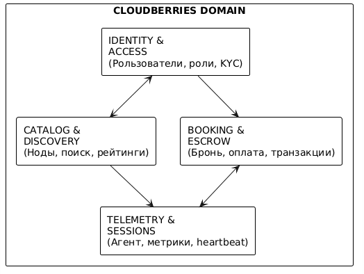
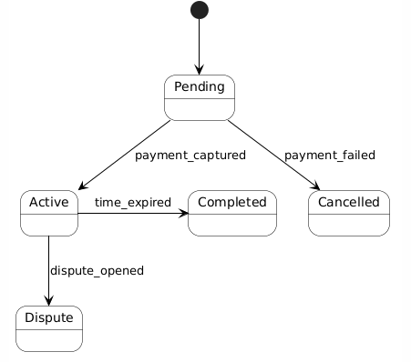
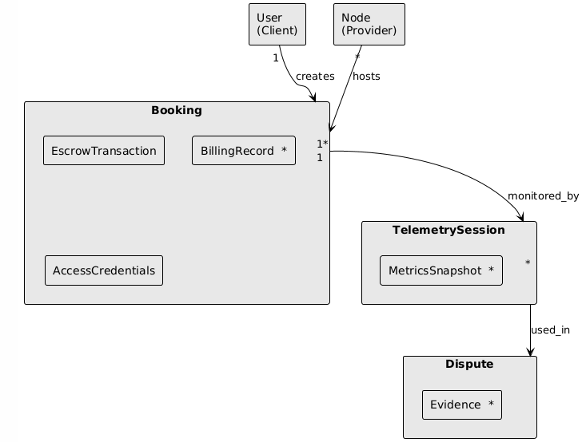

# Структура Итерации 5
Прежде чем писать, мы разбили задание на 6 логических пунктов. Это позволит нам двигаться поэтапно и не упустить требования: 
| № | Пункт | Что делаем |
|---|-------|------------|
| **1** | **Концептуальная модель предметной области** | Ключевые сущности, агрегаты, границы контекстов (DDD-lite), диаграмма |
| **2** | **Логическая модель данных (ER-диаграмма)** | Таблицы, связи, атрибуты, типы данных |
| **3** | **Трассировка модели на бизнес-требования** | Матрица: какая сущность закрывает какое требование из Итерации 2/3 |
| **4** | **Ключевые сценарии использования** | 3-4 основных happy path с привязкой к данным и архитектуре |
| **5** | **Сценарии с ошибками (Error Scenarios)** | Что происходит при сбоях: отключение агента, падение шлюза, спор |
| **6** | **Сценарии развития системы** | Как модель данных эволюционирует: v2.0, новые фичи, масштабирование |

# 1. Концептуальная модель предметной области

## 1.1. Границы контекстов (Bounded Contexts)

Модель предметной области Cloudberries разделена на **4 логических контекста**, каждый из которых решает свою бизнес-задачу. Это DDD-lite подход, согласованный с модульным монолитом из Итерации 4.

### Почему 4 контекста?
- **Identity & Access** — отвечает за требования **А3 (Time-to-Value)** и **Trust & KYC**
#### Требование А3: Скорость получения доступа (Time-to-Value)
| Параметр | Формализация |
|:---|:---|
| **Описание** | Минимизация времени от момента принятия решения об аренде до получения доступа к серверу (SSH/RDP/веб-терминал). |
| **Бизнес-обоснование** | В задачах рендеринга, обучения моделей или дедлайнов время — деньги. Долгая настройка сервера убивает продуктивность и мотивацию пользователя. |
| **Ключевые показатели (KPI)** | • `Time-to-SSH` ≤ 3 минут (p95) от успешной оплаты до получения ключей доступа • `Onboarding Completion Rate` ≥ 80% (пользователи, завершившие регистрацию и первую аренду) |
| **Критерии достижения** | • Процесс бронирования занимает не более 3-х кликов после выбора сервера • Автоматическая настройка окружения: Docker-контейнер поднимается сам, пользователю не нужно инсталлировать зависимости вручную |
| **Метод измерения** | Event-tracking (Mixpanel/Amplitude): замер времени между событиями `payment_success` → `ssh_credentials_delivered`, логи API деплоя |
| **Риски при невыполнении** | Пользователи не доходят до запуска задачи, высокий отток на этапе «получения доступа», негативные отзывы о сложности платформы |

- **Catalog & Discovery** — отвечает за требования **А1 (Cost-Efficiency)** и **П1 (Asset Utilization)**
#### Требование А1: Экономическая выгода (Cost-Efficiency)
| Параметр | Формализация |
|:---|:---|
| **Описание** | Получение вычислительных мощностей по стоимости, значительно ниже рыночных показателей крупных облачных провайдеров (AWS, GCP, RunPod). |
| **Бизнес-обоснование** | Целевая аудитория ограничена в бюджете. Если цена не будет конкурентной, смысл использования P2P-маркетплейса теряется — пользователи останутся на бесплатных тарифах или выберут более дешёвые аналоги. |
| **Ключевые показатели (KPI)** | • `Price Delta vs Market` ≤ -40% (средняя цена аренды на платформе ниже аналогов) • `Cost per Compute Unit` (за 1 vCPU/GPU-час) ниже эталона рынка |
| **Критерии достижения** | • Калькулятор на сайте показывает итоговую сумму, которая гарантированно ниже цен конкурентов при равных характеристиках (визуальное сравнение) • Отсутствие скрытых платежей (за трафик, IP, диски) в итоговом чеке — 100% прозрачность |
| **Метод измерения** | Парсинг цен конкурентов (AWS Calculator, Vast.ai API), A/B-тесты калькулятора, аналитика конверсии на этапе выбора тарифа |
| **Риски при невыполнении** | Низкая конверсия в оплату, высокий churn на этапе сравнения цен, невозможность набрать критическую массу арендаторов → сетевой эффект не запускается |

- **Booking & Escrow** — ядро платформы, отвечает за **Trust & Escrow** и **Billing Automation**
#### Требование 3: Обеспечение безопасности и доверия к сделкам (Trust & Escrow)
**Описание:** Внедрить систему эскроу-платежей и верификации, гарантирующую сохранность средств клиента и своевременную выплату провайдеру только после фактического оказания услуги.

| Параметр | Формализация |
|:---|:---|
| **Бизнес-обоснование** | В P2P-модели доверие — ключевой актив. Без гарантий обе стороны будут бояться мошенничества. Эскроу снижает арбитраж и повышает retention. |
| **Ключевые показатели (KPI)** | • `Successful Sessions Rate` ≥ 95% • `Arbitration Rate` ≤ 3% • `Dispute Resolution Time` ≤ 24 ч • `Verification Pass Rate` ≥ 80% |
| **Критерии достижения** | • 95% аренд завершаются без обращения в поддержку/арбитраж • Не более 3% транзакций требуют ручного вмешательства модератора • Среднее время закрытия спора не превышает 24 часов с момента создания тикета • 80% пользователей проходят KYC/Email+Phone верификацию без отвалов |
| **Метод измерения** | Метрики тикет-системы, логи статусов заказов, отчёты из эскроу-модуля, конверсия воронки верификации |
| **Риски при невыполнении** | Волна chargeback'ов, блокировка платёжного шлюза, репутационный ущерб, отток поставщиков из-за невыплат, юридические риски |

- **Telemetry & Sessions** — отвечает за **SLA Assurance** и **Host Security**

---

## 1.2. Ключевые сущности и агрегаты

### Агрегат 1: **User** (Корень агрегата в Identity Context)
| Сущность | Роль | Ключевые атрибуты |
|----------|------|-------------------|
| `User` | Корень агрегата | id, email, phone, role (Client/Provider/Admin), kyc_status, created_at |
| `Wallet` | Встроенная сущность | balance, frozen_amount, currency, payout_details |
| `Verification` | Встроенная сущность | kyc_level, documents_hash, verified_at |

**Связь с требованиями:**
- Закрывает **User Story 1.1** (регистрация) и **US-5.1** (низкий порог входа)
- Реализует бизнес-цель **Trust & Escrow** через KYC-уровни

### Агрегат 2: **Node** (Корень агрегата в Catalog Context)
| Сущность | Роль | Ключевые атрибуты |
|----------|------|-------------------|
| `Node` | Корень агрегата | id, provider_id, status (Online/Offline/Maintenance), price_per_hour, region |
| `HardwareSpecs` | Value Object | cpu_cores, ram_gb, gpu_model, gpu_vram_gb, disk_type, disk_gb |
| `AvailabilitySchedule` | Встроенная сущность | timezone, weekly_slots[], blocked_until |
| `Reputation` | Встроенная сущность | rating (0-5), total_sessions, interruption_rate |

**Связь с требованиями:**
- Закрывает **US-1.1** (фильтрация по GPU/CPU) и **US-2.1** (установка агента)
- Реализует **П1 (Asset Utilization)** через гибкое расписание
- Реализует **П2 (Host Security)** через изоляцию на уровне Node

### Агрегат 3: **Booking** (Корень агрегата в Booking Context) — **ЦЕНТРАЛЬНЫЙ АГРЕГАТ**
| Сущность | Роль | Ключевые атрибуты |
|----------|------|-------------------|
| `Booking` | Корень агрегата | id, client_id, node_id, status (Pending/Active/Completed/Cancelled/Dispute), started_at, ended_at |
| `EscrowTransaction` | Встроенная сущность | amount, currency, gateway_id, status (Hold/Captured/Refunded), idempotency_key |
| `BillingRecord[]` | Встроенные сущности | minute_offset, amount_charged, telemetry_snapshot_id |
| `AccessCredentials` | Value Object | ssh_key, ip_address, port, expires_at |

**State Machine статуса Booking:**

**Связь с требованиями:**
- Закрывает **US-1.2** (прозрачный калькулятор), **US-1.3** (мгновенный доступ)
- Реализует **Требование 3 (Trust & Escrow)** — ключевой агрегат для безопасности сделок
- Реализует **Требование 4 (Billing Automation)** через BillingRecord

### Агрегат 4: **TelemetrySession** (Корень агрегата в Telemetry Context)
| Сущность | Роль | Ключевые атрибуты |
|----------|------|-------------------|
| `TelemetrySession` | Корень агрегата | id, node_id, booking_id, started_at, last_heartbeat_at |
| `MetricsSnapshot[]` | Встроенные сущности | timestamp, cpu_load, ram_used_mb, gpu_temp, disk_io |
| `AgentState` | Встроенная сущность | agent_version, connection_status, last_command_id |

**Связь с требованиями:**
- Закрывает **US-3.2** (сбор телеметрии) и **US-3.1** (эскроу)
- Реализует **А4 (SLA Assurance)** — данные телеметрии используются для разрешения споров
- Реализует **П2 (Host Security)** — контроль за сессиями

### Агрегат 5: **Dispute** (Корень агрегата в Booking Context)
| Сущность | Роль | Ключевые атрибуты |
|----------|------|-------------------|
| `Dispute` | Корень агрегата | id, booking_id, raised_by, reason, status (Open/Investigating/Resolved) |
| `Evidence` | Встроенная сущность | type (telemetry/logs/chat), reference_id, attached_at |
| `Resolution` | Value Object | decision (refund/partial/none), amount, resolved_by, resolved_at |

**Связь с требованиями:**
- Закрывает **US-3.1** (арбитраж для админа)
- Реализует **Trust & Escrow** — финальная линия защиты доверия

## 1.3. Диаграмма связей между агрегатами

## 1.4. Связь модели с высокоуровневыми требованиями

| Бизнес-требование (Итерация 2-3) | Отвечающий агрегат | Ключевые сущности | Как модель обеспечивает требование |
|----------------------------------|--------------------|--------------------|-------------------------------------|
| **Supply Growth** (П1, монетизация) | `Node` | AvailabilitySchedule, Reputation | Гибкое расписание + рейтинг стимулируют провайдеров |
| **Demand Activation** (А1, А2, А3) | `Booking` + `Node` | EscrowTransaction, AccessCredentials | Прозрачная цена + мгновенный SSH-доступ |
| **Trust & Escrow** (Требование 3) | `Booking` + `Dispute` | EscrowTransaction, Evidence | Холдирование средств + арбитраж на основе телеметрии |
| **Billing Automation** (Требование 4) | `Booking` + `TelemetrySession` | BillingRecord, MetricsSnapshot | Поминутное списание привязано к реальным метрикам |
| **Host Security** (П2) | `TelemetrySession` | AgentState, MetricsSnapshot | Изоляция сессий + контроль heartbeat |
| **SLA Assurance** (А4) | `TelemetrySession` + `Dispute` | MetricsSnapshot, Evidence | Объективные данные для разрешения споров |

---

## 1.5. Ключевые концептуальные решения

### Решение 1: **Booking как центральный агрегат**
Все финансовые операции, доступы и состояния сессии инкапсулированы в одном агрегате. Это обеспечивает **ACID-транзакции** в PostgreSQL без распределённых саг — что напрямую соответствует архитектурному решению из Итерации 4 (модульный монолит).

### Решение 2: **BillingRecord как массив внутри Booking**
Поминутные записи биллинга хранятся как embedded-коллекция, а не отдельная таблица. Это:
- Гарантирует консистентность с Booking
- Упрощает аудит и разрешение споров
- Соответствует паттерну **Exactly-once billing** из NFR

### Решение 3: **TelemetrySession отделена от Booking**
Высокочастотные метрики (1000 msg/sec) изолированы в отдельном контексте. Это:
- Защищает основную БД от write-heavy нагрузки
- Соответствует решению "Agent Gateway как отдельный контейнер"
- Позволяет хранить метрики в Redis/TSDB, а в Postgres — только snapshot'ы для споров

### Решение 4: **Dispute использует Evidence как snapshot**
При открытии спора система делает snapshot телеметрии за период аренды. Это:
- Защищает данные от удаления/изменения
- Даёт администратору объективную картину
- Реализует KPI `Dispute Resolution Time ≤ 24ч`
